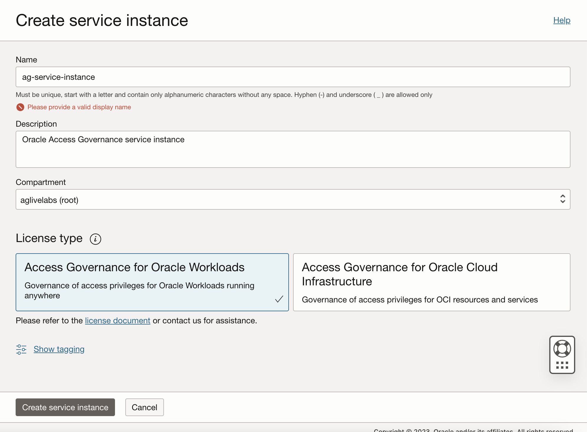
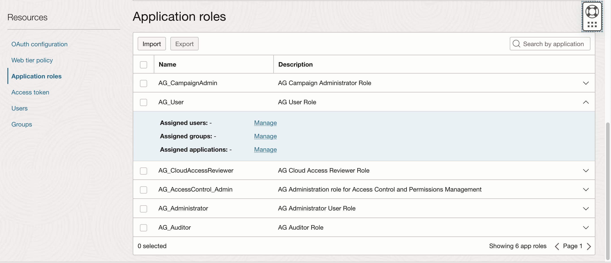
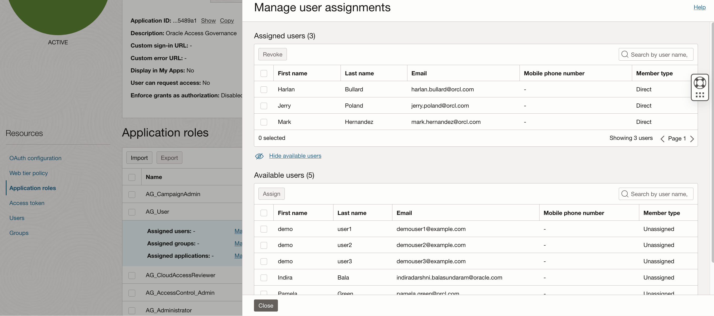

# Setup and configure Oracle Access Governance service instance

## Introduction

In this lab we will setup the OAG service instance and make configurations required to successfully run this workshop.

Persona: Identity Domain Administrator

*Estimated Time*: 30 minutes

Watch the video below for a quick walk-through of the lab.
[Oracle Video Hub video with no sizing](videohub:1_21nk0xhx)

### Objectives

In this lab, you will:

* Create AG Service Instance
* Access the AG console url
* Assign AG Roles to Users in OCI IAM

### Prerequisites

This lab assumes you have:

* A valid Oracle OCI tenancy, with OCI administrator privileges.
* Choose a region where Access Governance is available.

## Task 1: Create AG Service instance

Login to the OCI console using the Identity domain: ag-domain as the **Identity Domain Administrator** , if not currently not logged in to the Identity domain.

1. In the OCI console, click the Navigation Menu icon in the top left corner to display the *Navigation menu.* Click *Identity and Security* in the *Navigation menu*. Select *Access Governance* from the list of products. If you don't see the menu option, please check the region selected and make sure that Access Governance is available in that region.

    

2. On the Access Governance page, select *Service Instances.*

    ```
    Name: ag-service-instance
    Description: Oracle Access Governance service instance
    Compartment: Ensure your ag-compartment is selected
    ```

    

3. Select the License type : Access Governance for Oracle Workloads. Click on *Create Service Instance*

    

4. Wait for the service instance to have the *Active* status . Note down this URL as we will be using it in the further labs.

    

5. Click on the Service Instance to access the URL.

    

## Task 2: Modify the Email ID of the Users in OCI IAM
    
1. Login to the OCI console Identity Domain: ag-domain as the Identity Domain Administrator.

2. In the OCI console, navigate to Identity -> Domains -> ag-domain -> Users

3. Click on the Downward arrow on the right corner for each of them and select View details

4. Click on Edit User.

    Modify the Email field of the users to the following values:

    pamela.green : pamela.green@orcl.com

    mhernandez : mark.hernandez@orcl.com

    harlan.bullard : harlan.bullard@orcl.com
    
    jerry.poland : jerry.poland@orcl.com

  Click Save changes


## Task 3: Assign AG Application Roles to Users

1. Login to the OCI console Identity Domain: ag-domain as the Identity Domain Administrator.

2. In the OCI console, navigate to Identity -> Domains ->  ag-domain -> Oracle Cloud Services -> AG-service-instance -> Application Role.

    * Notice the *AG Administrator* Role and Click on the Downward arrow on the right corner.

    

    * Click on *Assigned Users -> Manage*. Select *Pamela Green* in *Available Users.* Click on *Assign*

    

    * The user Pamela Green is now visible under *Assigned Users*.

    

    * Pamela Green has been assigned with the *AG Administrator* application role. You can now close the window.

3. Now, Notice the *AG User* Role listed. Assign the role to each of the users : *Mark Hernandez*, *Harlan Bullard* and *Jerry Poland*.

    


    * Click on *Assigned Users -> Manage*. Select *Mark Hernandez*, *Harlan Bullard* and *Jerry Poland* in *Available Users.* Click on *Assign*. The Users appear under *Assigned Users* :

    


    * Mark Hernandez, Harlan Bullard and Jerry Poland have now been assigned with the *AG User* application role. You can now close the window.

    You may now **proceed to the next lab.**

## Learn More

* [Oracle Access Governance Create Access Review Campaign](https://docs.oracle.com/en/cloud/paas/access-governance/pdapg/index.html)
* [Oracle Access Governance Product Page](https://www.oracle.com/security/cloud-security/access-governance/)
* [Oracle Access Governance Product tour](https://www.oracle.com/webfolder/s/quicktours/paas/pt-sec-access-governance/index.html)
* [Oracle Access Governance FAQ](https://www.oracle.com/security/cloud-security/access-governance/faq/)

## Acknowledgments

* **Authors** - Anuj Tripathi, Anbu Anbarasu
* **Last Updated By/Date** - Anuj Tripathi, October 2023
