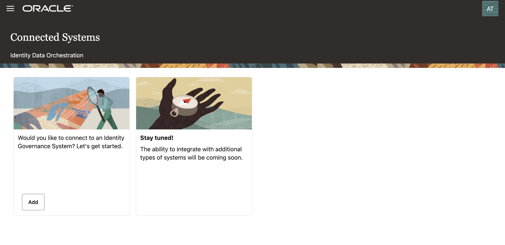
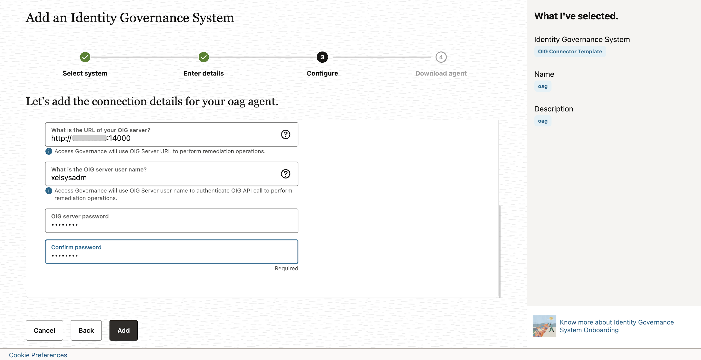
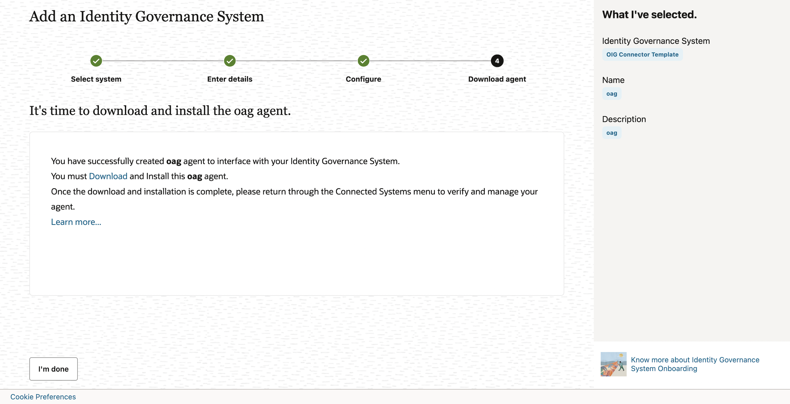
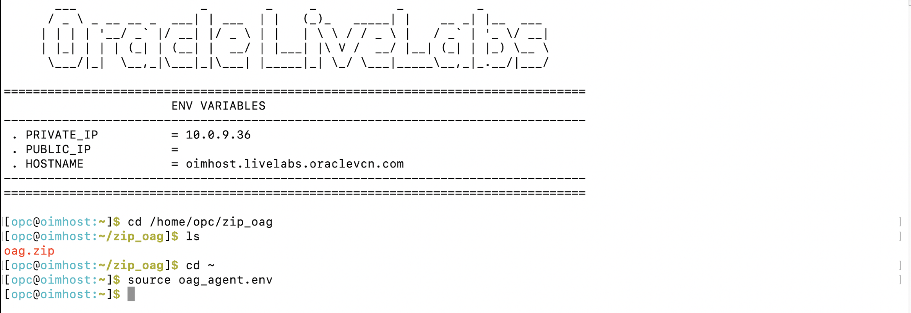
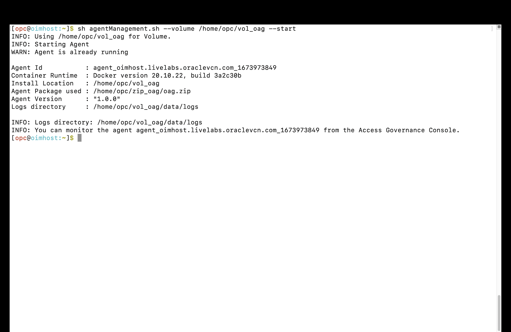
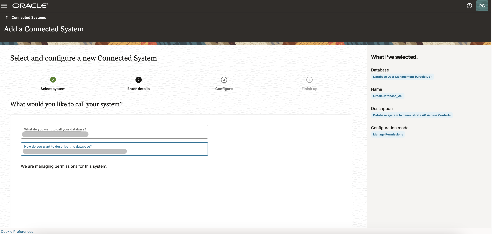
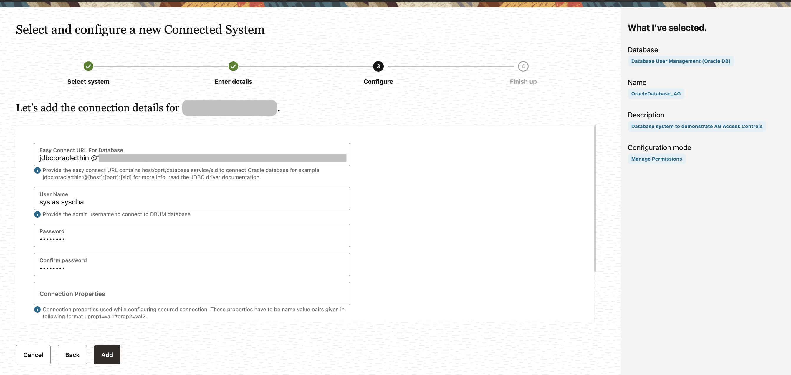
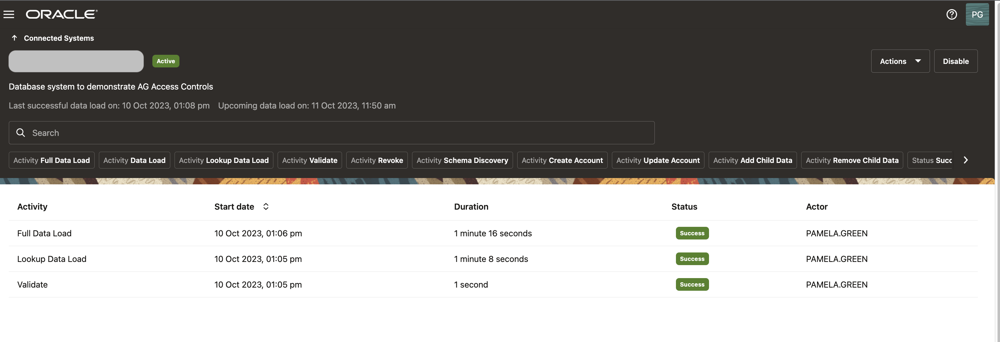

# Connect to OIG and Oracle Database

## Introduction

Establish Connection to Oracle Database and Oracle Identity Governance

* Persona: Identity Domain Administrator

*Estimated Time*: 15 minutes

Watch the video below for a quick walk-through of the lab.
[Oracle Video Hub video with no sizing](videohub:1_61qwyi4k)

### Objectives

In this lab, you will:

* Establish Connection to an Oracle Identity Governance and an Oracle Database

### Prerequisites

This lab assumes you have:

A valid Oracle OCI tenancy, with OCI administrator privileges.

## Task 1 : Verify Docker is up and Running

1. Open a terminal session.

2. Check the version of the docker.

    ```
    <copy>docker -v</copy>
    ```

    ```
    Expected output: Docker version 23.0.0, build e92dd87
    ```

3. Validate the status to verify if docker service is up/running

    ```
    <copy>systemctl status docker</copy>
    ```

     Enter **Ctrl+C** to return to the command prompt

## Task 2: Start the Oracle Identity Governance (OIG) DB Service

1. Move to the directory where the script files are located.

    ```
    <copy>cd /scratch/idmqa/scripts</copy>
    ```

2. List the files inside the directory.

    ```
    <copy>ls</copy>
    ```

3. Start DB and all servers manually,using below scripts.

    ```
    <copy>./start_db.sh</copy>
    ```

    Wait till DB gets started.

4. Now start the OIG services, using the below command.

    ```
    <copy>./start_all_servers.sh</copy>
    ```

## Task 3: Verify the Private IP address of Compute Instance

1. Launch a browser window. Login to OCI console using the URL mentioned below. The OCI account sign in page appears. Enter the username and password provided during signup.

    ```
    <copy>https://console.us-ashburn-1.oraclecloud.com/</copy>
    ```

2. Click the Navigation Menu icon in the top left corner to display the *Navigation menu.* Select *Compute* in the *Navigation menu*. Select *Instances* from the list of products.

    

3. Notedown the Private IP address of the Compute Instance for reference. We will require to use them in the further labs.

      

    You may now **proceed to the next lab.**

## Task 4: Integrate with Oracle Identity Governance

1. On the Oracle Access Governance service home page *refer Lab 2:Task 1*, click on the Navigation Menu icon and select **Service Administration** and then **Connected Systems.**

    

2. Click on **Add a connected system**

    

3. On the tile labeled **Would you like to connect to an Identity Governance System** select the **Add** button.
    

4. Click **Close** on the information pop-up to navigate to the **Add an Identity Governance System** page and begin the configuration.

    

5. On the **Select System** step, select the tile for **Oracle Identity Governance** to configure the agent for a target Oracle Identity Governance connected system, and then click **Next.**

    

6. On the **Enter Details** step, enter the following details:

    * **Name:** oag
    * **Description:** oag
    * **Click Next.**

    

7. On the **Configure** step, enter connection details for the target system:

    **JDBC URL:**
    Replace the placeholder in the below url with the private ip of your compute instance. Refer to *Task 3 : Step 3*  above for the private ip of your compute instance.

    ```
    <copy>jdbc:oracle:thin:@//<--privateipofyourcomputeinstance-->:1521/ORCL.NETWORKSPEOSUBN.IDMOCICLOU02PHX.ORACLEVCN.COM</copy>
    ```

    **OIG Database User Name:**

    ```
    <copy>DEV_OIM</copy>
    ```

    **Password:**

    ```
    <copy>Welcome1</copy>
    ```

    **Confirm Password:**

    ```
    <copy>Welcome1</copy>
    ```

    **OIG Server URL:**
    Replace the placeholder in the below url with the private ip of your compute instance. Refer to *Lab 3 : Task 3*  for the private ip of your compute instance.

    ```
    <copy>http://<--privateipofyourcomputeinstance-->:14000</copy>
    ```

    **OIG Server User Name:**

    ```
    <copy>xelsysadm</copy>
    ```

     **OIG Server User Password:**

    ```
    <copy>Welcome1</copy>
    ```

    **OIG Server Confirm Password:**

    ```
    <copy>Welcome1</copy>
    ```

     

8. On the Download Agent step, select the *Download link* and download the agent zip file. The zip file is present in: /home/opc/Downloads

    

9. You can verify the downloaded agent zip file.

     

     

## Task 5: Install OAG Agent on the Compute Instance and Configure

1. Open the terminal session.

    

2. Move the downloaded zip file (oag.zip) present in the /home/opc/Downloads folder to /home/opc/zip_oag folder.

    ```
    <copy>mv /home/opc/Downloads/oag.zip /home/opc/zip_oag</copy>
    ```

    

    Verify the Agent zip (oag.zip) is present inside folder zip_oag.

    ```
    <copy>cd /home/opc/zip_oag</copy>
    <copy>ls</copy>
    ```

    

3. Setting the Environment variables using the below command:

    ```
    <copy>cd ~</copy>
    <copy>source oag_agent.env</copy>
    ```

    

4. Install the agent

    ```
    <copy>sh agentManagement.sh --volume /home/opc/vol_oag --agentpackage /home/opc/zip_oag/oag.zip --install</copy>
    ```

    

5. Start the agent

    ```
    <copy>sh agentManagement.sh --volume /home/opc/vol_oag --start</copy>
    ```

    

6. Verify the agent

    ```
    <copy>sh agentManagement.sh --volume /home/opc/vol_oag --status</copy>
    ```

    

## Task 6: Connect to Oracle Database and download the DB Agent

1. Navigate to the **Connected Systems** page of the Oracle Access Governance Console, by following these steps:
  From the Oracle Access Governance navigation menu icon **Navigation menu**, select **Service Administration** → **Connected Systems**.
  Click the **Add a connected system** button to start the workflow.

2. From the Add a Connected System page, Select the **Add** button on the **Would you like to connect to a database management system?** tile.

3. On the Select system step of the workflow, Select **Database User Management (Oracle DB)** and click **Next**.

4. On the **Enter Details** step of the workflow, enter the details for the connected system:

    * **What do you want to call your database** : OAG-DB
    * **How do you want to describe this database**: OAG-DB

      Click **Next**

    

5. On the Configure step of the workflow, enter the configuration details required to allow Oracle Access Governance to connect to the target database.

    **Easy Connect URL for Database**:

    **JDBC URL:**
    Replace the placeholder in the below url with the private ip of your compute instance. Refer to *Task 3 : Step 3*  above for the private ip of your compute instance.

    ```
    <copy>jdbc:oracle:thin:@//<—privateipaddressofcomputeinstance-->/ORCL.NETWORKSPEOSUBN.IDMOCICLOU02PHX.ORACLEVCN.COM</copy>
    ```

    **User Name**:

    ```
    <copy>sys as sysdba</copy>
    ```

    **Password**:

    ```
    <copy>Welcome1</copy>
    ```

    **Confirm password**:

    ```
    <copy>Welcome1</copy>
    ```

    

6. Check the right hand pane to view What I've selected. If you are happy with the details entered, select **Add** to create the connected system.

7. On the Finish Up step of the workflow, you are asked to download the agent you will use to interface between Oracle Access Governance and Oracle Database. Select the **Download** link to download the agent zip file to the environment in which the agent will run. Click on **Activate** and **I'm done**

    


## Task 7: Install the DB Agent on the Target System

1. Open the terminal.

2. Create the volume.

    ```
    <copy>mkdir  /home/opc/vol_oag_db</copy>
     ```

3. Verify the Agent zip (OAG-DB.zip) is present inside folder Downloads.

    ```
    <copy> cd /home/opc/Downloads
    ls</copy>
     ```

4. Setting the Environment variables using the below command:

    ```
    <copy> cd ~
    source oag_agent.env</copy>
     ```

2. Install the agent using the below commands:

     ```
    <copy>curl https://raw.githubusercontent.com/oracle/docker-images/main/OracleIdentityGovernance/samples/scripts/agentManagement.sh -o agentManagement.sh;</copy>
     ```

     ```
    <copy>sh agentManagement.sh --volume /home/opc/vol_oag_db --agentpackage /home/opc/Downloads/OAG-DB.zip --install</copy>
     ```

3. Start the agent with the following command:

     ```
      <copy>sh agentManagement.sh --volume /home/opc/vol_oag_db --start</copy>
     ```

## Task 8: Verify the Agent Installation

1. Login to the Oracle Access Governance Console, select the Navigation Menuicon to display the navigation menu.
2. In the Oracle Access Governance Console, select Service Administration → Connected Systems from the navigation menu.
3. On the Connected Systems screen, the tile showing the name of the connected system shows a status of Waiting for initial connection. Click on Manage Connection.
4. The Activity Log at the bottom of the page will show the status of the Validate operation, Pending while the agent comes up. If the agent does not come up, check the agent install and operation logs for any issues.



5. Once the agent has come up, the status of the Validate operation will show as Success.

  You may now **proceed to the next lab**.

## Learn More

* [Oracle Access Governance Create Access Review Campaign](https://docs.oracle.com/en/cloud/paas/access-governance/pdapg/index.html)
* [Oracle Access Governance Product Page](https://www.oracle.com/security/cloud-security/access-governance/)
* [Oracle Access Governance Product tour](https://www.oracle.com/webfolder/s/quicktours/paas/pt-sec-access-governance/index.html)
* [Oracle Access Governance FAQ](https://www.oracle.com/security/cloud-security/access-governance/faq/)

## Acknowledgements

* **Authors** - Anuj Tripathi, Anbu Anbarasu
* **Last Updated By/Date** - Anuj Tripathi, October 2023
