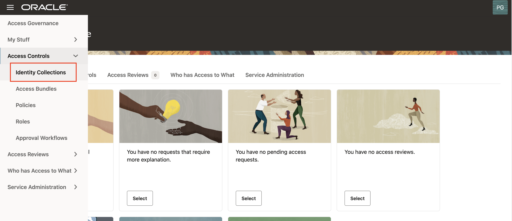
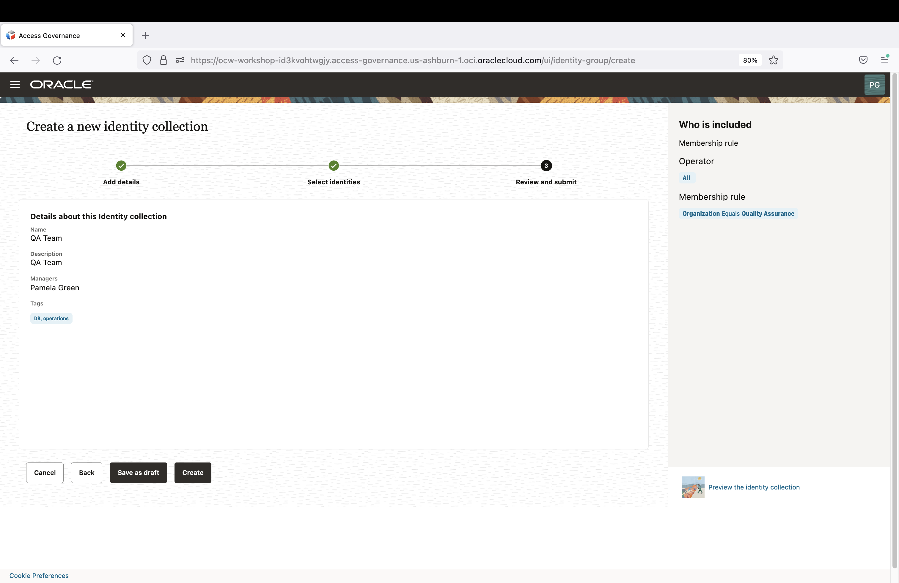
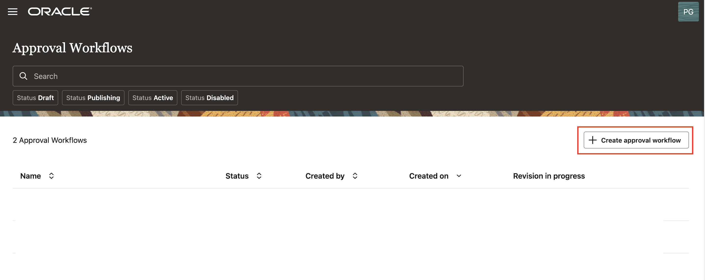
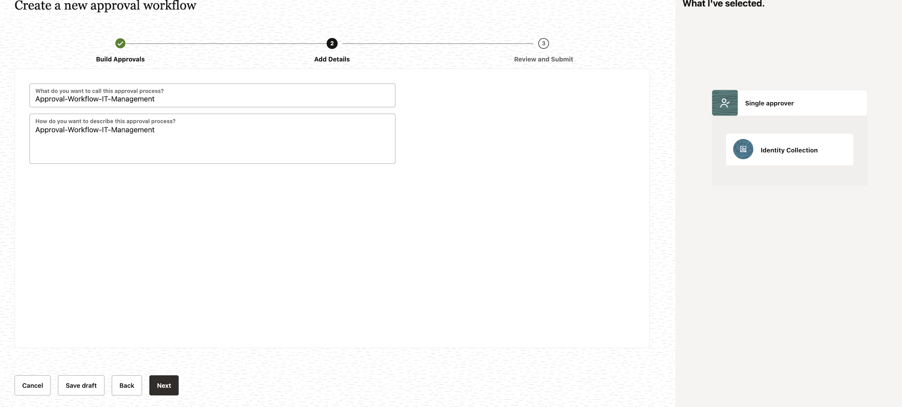
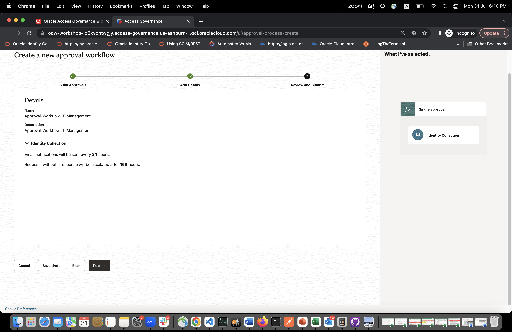
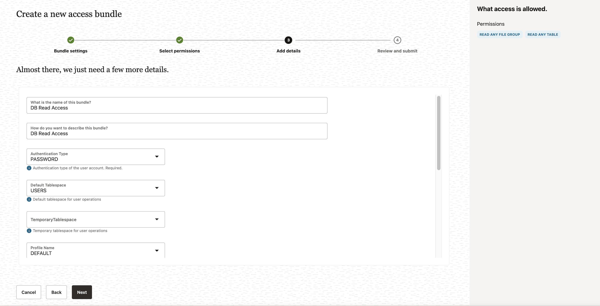
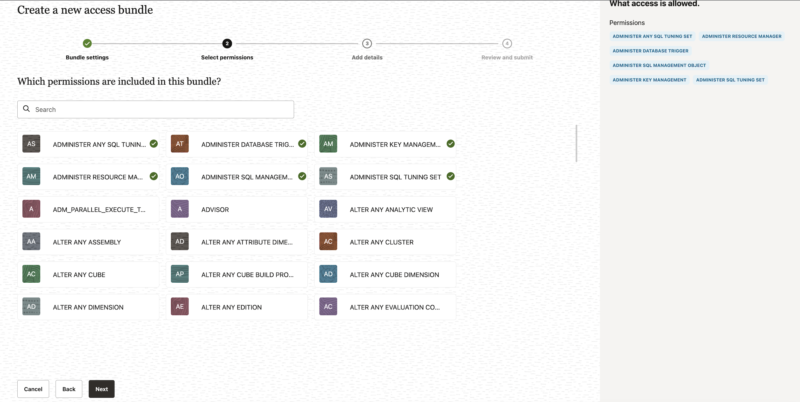
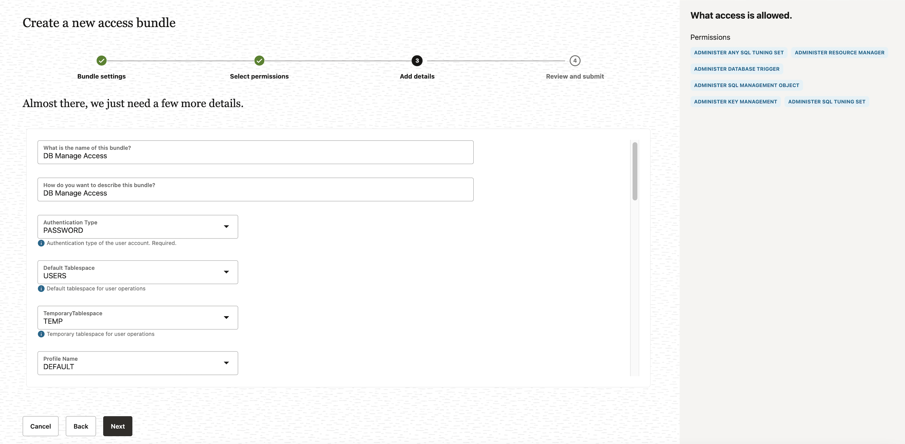
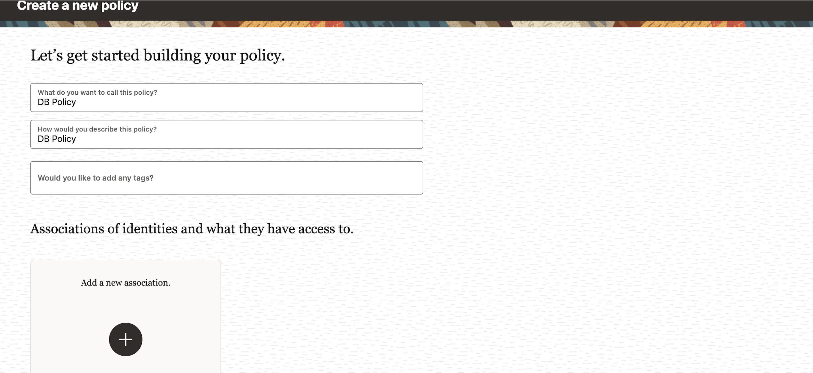
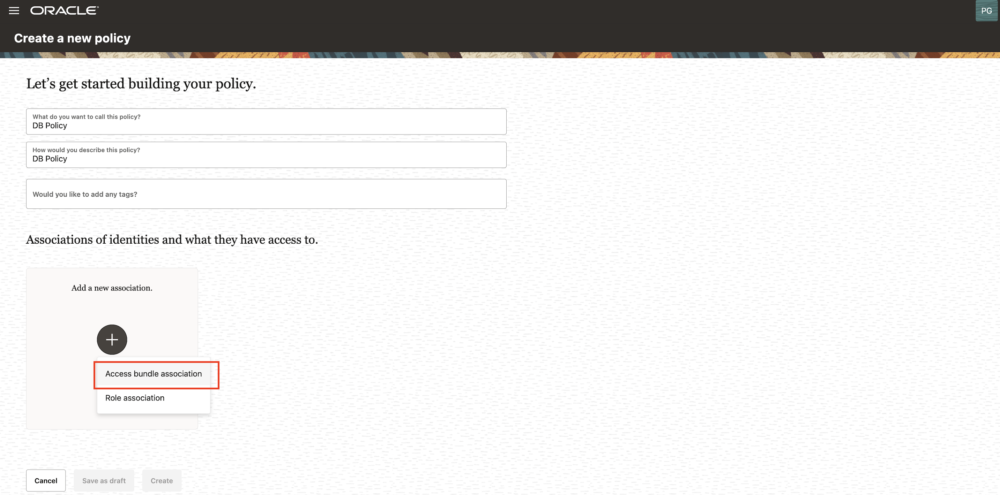

# Access Control

## Introduction

In this lab we will review Access-Control of Access Governance

*Estimated Time*: 15 minutes

### Objectives

In this lab, you will:
 * Create an Identity Collection
 * Create an Approval Workflow with parallel escalation rules
 * Create an Access Bundle
 * Create a centralized policy to provision access privileges

## Task 1: Create an Identity Collection - IT Management

1. On the Access Governance console home page, click the Access Controls tab. Then, click Select on the Identity Collections tile. 

     

      

2. On the Identity Collections page, your created Identity Collections will be listed here. Click Create identity collection to Create an Identity Collection.

   

3. Enter the below mentioned details Under Add Details tab:

    What do you want to call this identity collection? : IT-Management
    How would you describe this collection? : IT-Management
    Who can manage this identity collection : pamela.green
    Would you like to add any tags? : approvers

    Click on *Next*

   

4. Under Select Identities -> Included named identities , select the below mentioned option.

    Select *Pamela Green*

    Click on *Next*

    

5. Click on *Create*

    

## Task 2: Create an Identity Collection - Quality Assurance

1. On the Access Governance console home page, click the Access Controls tab. Then, click Select on the Identity Collections tile. 

2. On the Identity Collections page, your created Identity Collections will be listed here. Click Create identity collection to Create an Identity Collection.

    

   

  

3. Enter the below mentioned details Under Add Details tab:

    What do you want to call this identity collection? : QA Team
    How would you describe this collection? : QA Team
    Who can manage this identity collection : pamela.green
    Would you like to add any tags? : DB, database, operations

    Click on *Next*

    

4. Under Select Identities -> Membership rule , select the below mentioned option.

    Select the *All* checkbox.

    Select attribute: Organization
    Condition: Equals
    Attribute field: Quality Assurance

    

5. Click on *Create*

    

## Task 3: Create an Approval Workflow 

1. On the Access Governance console home page, click the Access Controls tab. Then, click Select on the Manage Approval Workflows tile. 

   

2. On the Approval Workflows page, your created approval workflows will be listed here. Click Create approval workflow to create your first Approval Workflow.

    

    
    

3. Let’s build your approval workflow now. Click the “+” button and configure your approval workflow based on the following:

    •	Which type of approval?: Identity Collection

    •	Approval Identity Collection: IT Management   

    •	For all other fields, leave as default

    •	Click Add

     

     
    

     After confirming your configuration matches the following, click Next

5. On the Add Details page, name your Approval Workflow: Approval-Workflow-IT-Management. Then, provide any description. Click Next to review your configurations so far, then click Publish.

     

     

## Task 4: Create an Access Bundle

1. On the Access Governance console home page, click the Access Controls tab. Then, click Select on the Access Bundles tile. 

    
   

2. Click on Create an access bundle - DB Read Access 

     
  

3. For your bundle settings, configure your bundle to match the following:

    •	Which target is this bundle for?: OAG-DB

    •	Who can request this bundle?: Anyone

    •	Which approval workflow should be used?: Approval-Workflow-IT-Management

     Click Next. 

    

4. Select the permissions to be included in the access bundle. 

    Which permissions are included in this bundle? : Select the below to be included in the access bundle from the list. 

    * READ ANY FILE GROUP

    * READ ANY TABLE

     

    Click Next. 

5. In the Add Details step, configure the following:

    •	What is the name of this bundle?: DB Read Access 

    •	How do you want to describe this bundle?: DB Read Access 

    •	Authentication Type: PASSWORD

    •	TemporaryTablespace: TEMP

    •	Profile Name: DEFAULT

    •	Default Tablespace: USERS

    •	Leave all other options as default

     

    Then, Click Next.

6. Review your configurations made until this point. It should look like the configurations depicted below, except for the name. Then, click Create. 

     

7. Click on Create an access bundle - DB Manage Access 

     
  

8. For your bundle settings, configure your bundle to match the following:

    •	Which target is this bundle for?: OAG-DB

    •	Who can request this bundle?: Anyone

    •	Which approval workflow should be used?: Approval-Workflow-IT-Management

   Click Next. 

    

9. Select the permissions to be included in the access bundle. 

    Which permissions are included in this bundle? : Select the below to be included in the access bundle from the list. 

    * ADMINISTER ANY SQL TUNING SET

    * ADMINISTER DATABASE TRIGGER

    * ADMINISTER KEY MANAGEMENT

    * ADMINISTER RESOURCE MANAGER

    * ADMINISTER SQL MANAGEMENT OBJECT

    * ADMINISTER SQL TUNING SET

     

    Click Next. 

10. In the Add Details step, configure the following:

    •	What is the name of this bundle?: DB Manage Access 

    •	How do you want to describe this bundle?: DB Manage Access 

    •	Authentication Type: PASSWORD

    •	TemporaryTablespace: TEMP

    •	Profile Name: DEFAULT

    •	Default Tablespace: USERS

    •	Leave all other options as default

     

    Then, Click Next.

11. Review your configurations made until this point. It should look like the configurations depicted below, except for the name. Then, click Create. 

     

## Task 5: Create a Centralized Policy to provision Access Privileges

1. On the Access Governance console home page, click the Access Controls tab. Then, click Select on the Policies tile. 

   

    

2. On the Policies page, you will see a list of your created policies. Click Create a policy. 

   

  

3. Give your policy a name and description like the following:

    •	What do you want to call this policy?:DB Policy

    •	How would you describe this policy?: DB Policy

     

4. Now on this same page, let’s add an Access Bundle Association. Lower on the page, click the “+” button and select Access Bundle Association. 

     

5. Search for which identity collection you want to allow access : QA Team. Your selection will be marked with a green checkmark. Click Next

     

6. Search for which access bundle you want to assign : DB Read Access. Your selection will be marked with a green checkmark.

     

    Then, click Next. 

7. On the Review and submit page, you may click Preview policy association in the bottom right corner before your create it. After, close that sidebar and click Add association. 

     

8. Finally, click Create.

## Task 6: Run a Manual Dataload

1. On the Access Governance console home page, navigate to Service Administration -> Connected System. 

   

2. On the Connected Systems page, select the **OAG-DB** connected system. 

   

3. Click on  Actions -> Load Data Now. This will perform a manual data load. 

    

4. Once the data load is complete, the status will be shown as Success. 

    You may now **proceed to the next lab.**

## Learn More

* [Oracle Access Governance Create Access Review Campaign](https://docs.oracle.com/en/cloud/paas/access-governance/pdapg/index.html)
* [Oracle Access Governance Product Page](https://www.oracle.com/security/cloud-security/access-governance/)
* [Oracle Access Governance Product tour](https://www.oracle.com/webfolder/s/quicktours/paas/pt-sec-access-governance/index.html)
* [Oracle Access Governance FAQ](https://www.oracle.com/security/cloud-security/access-governance/faq/)

## Acknowledgements
* **Authors** - Anuj Tripathi, Indira Balasundaram, Anbu Anbarasu 