# Access Control

## Introduction

In this lab we will review Access-Control of Access Governance

*Estimated Time*: 15 minutes

### Objectives

In this lab, you will:
 * Create an Identity Collection
 * Create an Approval Workflow with parallel escalation rules
 * Create an Access Bundle
 * Create a Database Role
 * Create a centralized policy to provision access privileges

## Task 1: Create an Identity Collection - IT Management

1. On the Access Governance console home page, click the Access Controls tab. Then, click Select on the Identity Collections tile. 

     

      

2. On the Identity Collections page, your created Identity Collections will be listed here. Click Create identity collection to Create an Identity Collection.

   

3. Enter the below mentioned details Under Add Details tab:

    What do you want to call this identity collection? : IT-Management
    How would you describe this collection? : IT-Management
    Who can manage this identity collection : pamela.green
    Would you like to add any tags? : approvers

    Click on *Next*

   

4. Under Select Identities -> Included named identities , select the below mentioned option.

    Select *Pamela Green*

    Click on *Next*

    

5. Click on *Create*

    

## Task 2: Create an Identity Collection - IT Operations

1. On the Access Governance console home page, click the Access Controls tab. Then, click Select on the Identity Collections tile. 

2. On the Identity Collections page, your created Identity Collections will be listed here. Click Create identity collection to Create an Identity Collection.

    

   

  

3. Enter the below mentioned details Under Add Details tab:

    What do you want to call this identity collection? : IT-Operations
    How would you describe this collection? : IT-Operations
    Who can manage this identity collection : pamela.green
    Would you like to add any tags? : DB, database, operations

    Click on *Next*

    

4. Under Select Identities -> Membership rule , select the below mentioned option.

    Select the *All* checkbox.

    Select attribute: Organization
    Condition: Begins with 
    Attribute field: Software 

    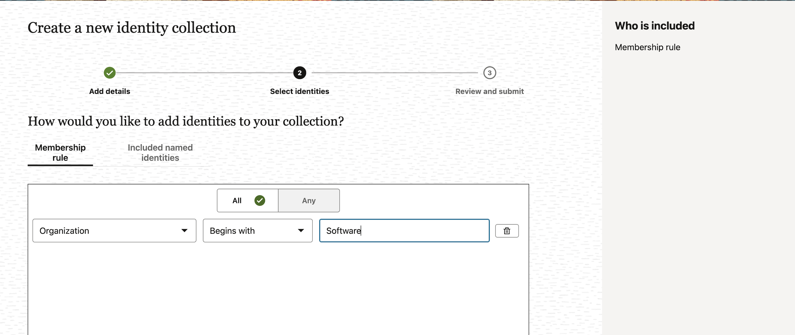

    Under Select Identities -> Included named identities , select the below mentioned option.

    Select *marian.smith*

    Click on *Next*

    

5. Click on *Create*

    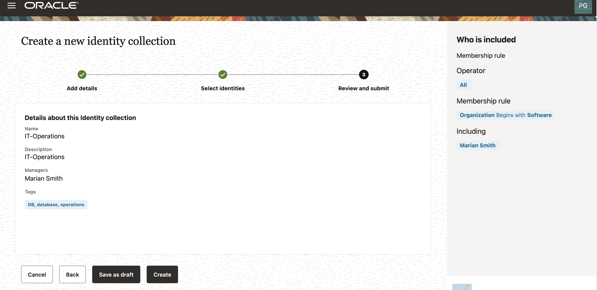

## Task 3: Create an Approval Workflow 

1. On the Access Governance console home page, click the Access Controls tab. Then, click Select on the Manage Approval Workflows tile. 

   

2. On the Approval Workflows page, your created approval workflows will be listed here. Click Create approval workflow to create your first Approval Workflow.

    

    
    

3. Let’s build your approval workflow now. Click the “+” button and configure your approval workflow based on the following:

    •	Which type of approval?: Beneficiary’s Manager 
    •	For all other fields, leave as default
    •	Click Add

     

    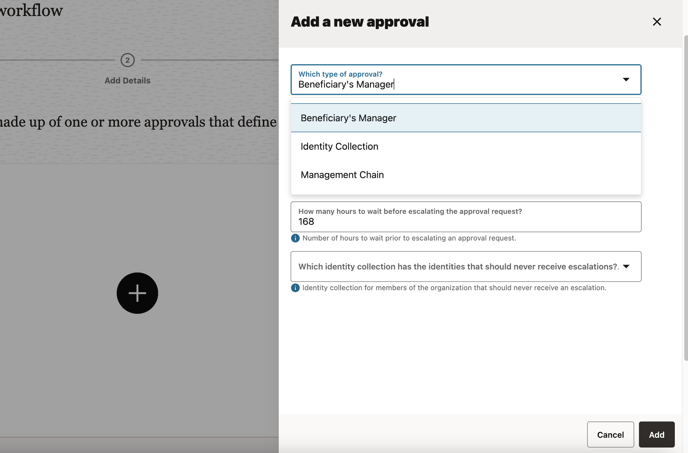 

4. Now let’s define a parallel approval rule. This means you are defining a two-level approval workflow to approve the request. Click Add parallel and configure based on the following:

    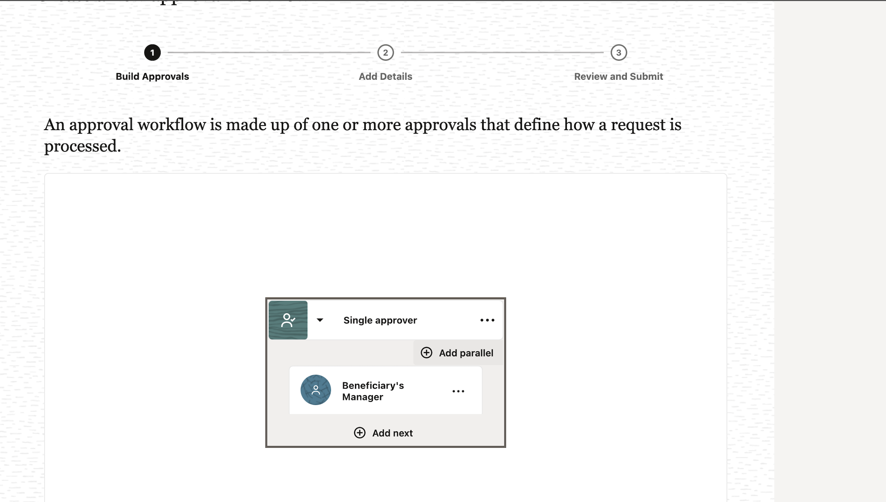 

    •	Which type of approval?: Identity Collection
    •	Approval identity collection: IT Management
    •	For all other fields, leave as default
    •	Click Add

     

    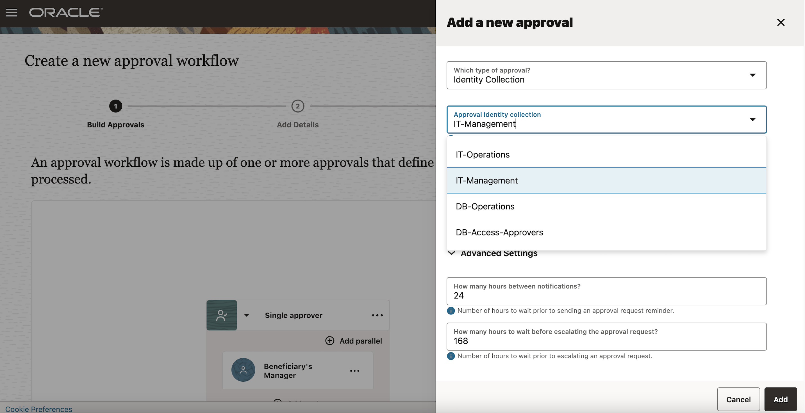 

    Your approval workflow should look like the depicted image below, except for the name. Be sure to select All above the approval rules. All approvers will be required to approve the request, whereas Any means either approver can approve the request. After confirming your configuration matches the following, click Next

5. On the Add Details page, name your Approval Workflow: Approval-Workflow-IT-Management. Then, provide any description. Click Next to review your configurations so far, then click Publish.

    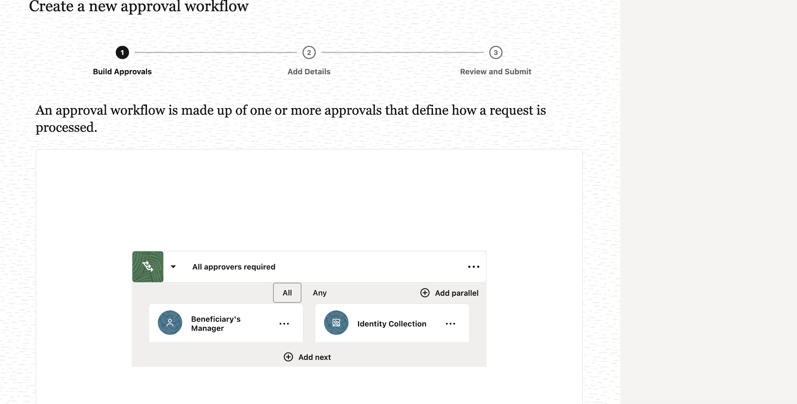 

     

## Task 4: Create an Access Bundle

1. On the Access Governance console home page, click the Access Controls tab. Then, click Select on the Access Bundles tile. 

    
   

2. Click on Create an access bundle. 

     
  

3. For your bundle settings, configure your bundle to match the following:
    •	Which target is this bundle for?: OAG-DB
    •	Who can request this bundle?: Anyone
    •	Which approval workflow should be used?: Approval-Workflow-IT-Management
    i.	You created this approval workflow earlier in this lab
    Then, Click Next. 

    

4. Select the permissions to be included in the access bundle. 

    Which permissions are included in this bundle? : Select 20-30 permissions to be included in the access bundle from the list. 

     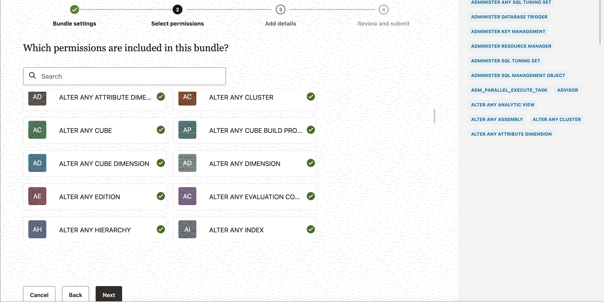

    Click Next. 

5. In the Add Details step, configure the following:

    •	What is the name of this bundle?: Access-Bundle-IT-Management
    •	How do you want to describe this bundle?: Type anything
    •	Authentication Type: PASSWORD
    •	Default Tablespace: USERS
    •	Leave all other options as default

     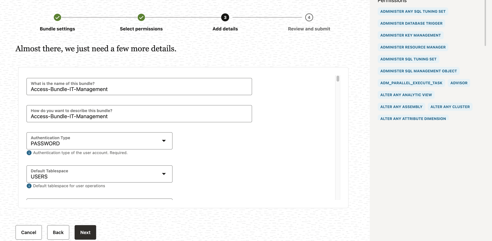

    Then, Click Next.

6. Review your configurations made until this point. It should look like the configurations depicted below, except for the name. Then, click Create. 

     

    
## Task 5: Create a Role 

1. On the Access Governance console home page, click the Access Controls tab. Then, click Select on the Roles tile. 

   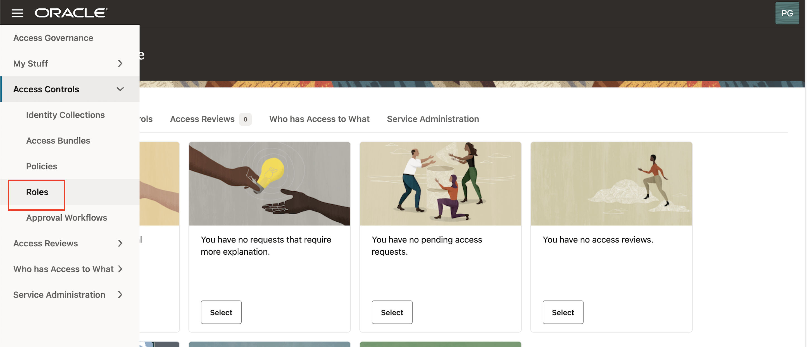

2. Click on Create a Role. 

    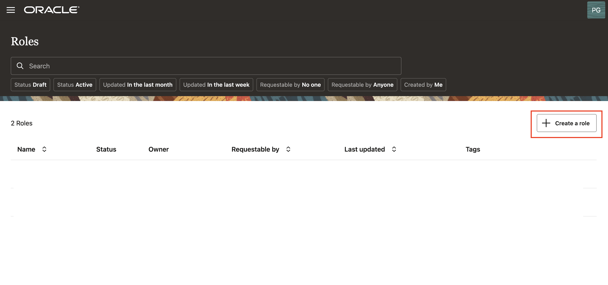

  

3. For your role settings, configure it to match the following:
    •	Who can request this role?: Anyone 
    •	Which approval workflow: Approval-Workflow-IT-Management
    •	Would you like to add any tags to this resource?: DB role

    Then, Click Next. 

     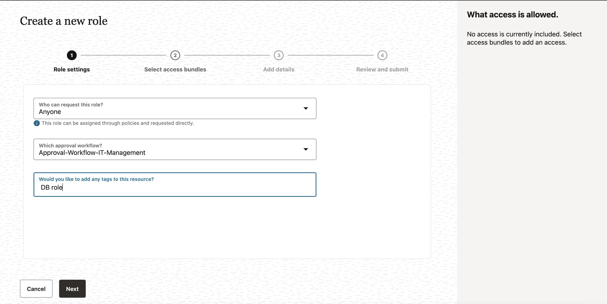

4. Select the access bundle to be included for the role : Access-Bundle-IT-Management. 

     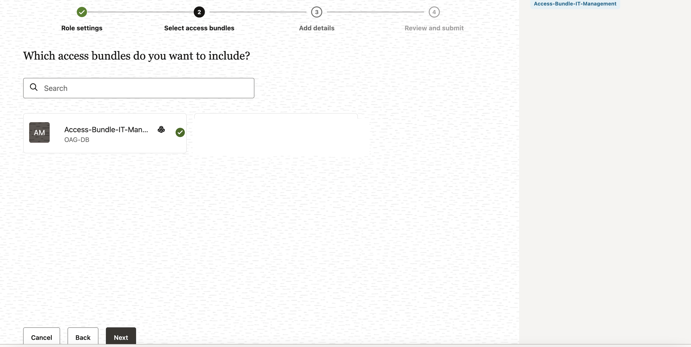

    Click Next. 

5. In the Add Details step, configure the following:
    •	What is the name of this role? : AG-Role 
    •	How do you want to describe this role?: AG Role for Oracle DB

     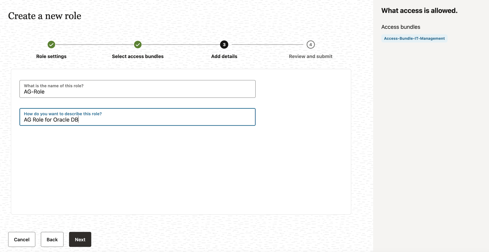

    Then, Click Next.

6. Click on Create role and assign. 

     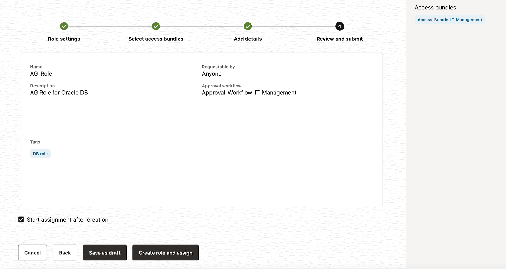

## Task 6: Create a Centralized Policy to provision Access Privileges

1. On the Access Governance console home page, click the Access Controls tab. Then, click Select on the Policies tile. 

   

    

2. On the Policies page, you will see a list of your created policies. Click Create a policy. 

   

  

3. Give your policy a name and description like the following:

    •	What do you want to call this policy?:DB Policy
    •	How would you describe this policy?: type anything

     

4. Now on this same page, let’s add a Role Association. Lower on the page, click the “+” button and select Role association. 

     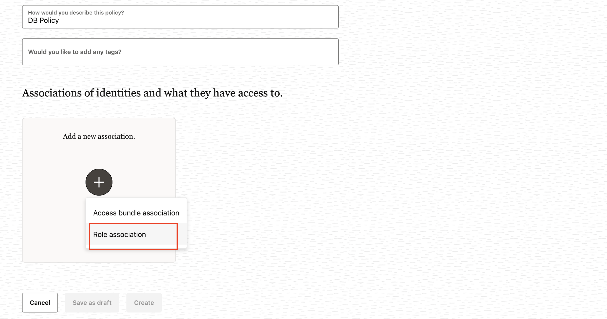

5. Search for the Identity Collection : IT-Operations. Your selection will be marked with a green checkmark.

     

    Then, click Next. 

6. Select the Role you want to assign. Select AG-Role and Click Next.

     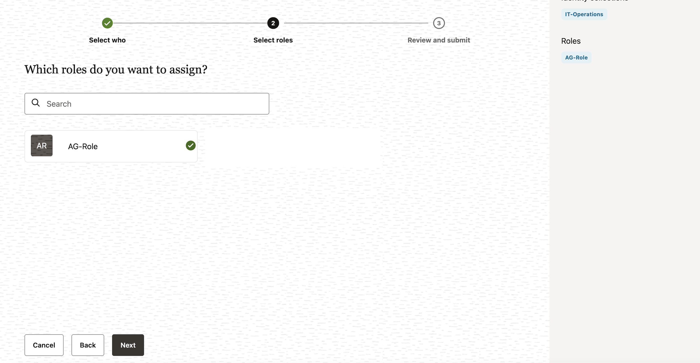

7. On the Review and submit page, you may click Preview policy association in the bottom right corner before your create it. After, close that sidebar and click Add association. 

     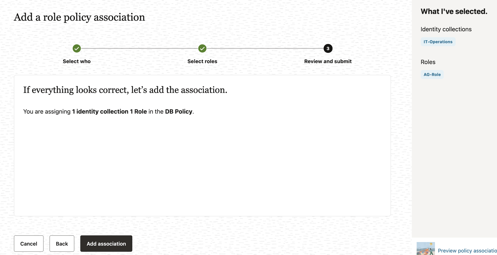

8. Finally, click Create.

     

    You may now **proceed to the next lab.**

## Learn More

* [Oracle Access Governance Create Access Review Campaign](https://docs.oracle.com/en/cloud/paas/access-governance/pdapg/index.html)
* [Oracle Access Governance Product Page](https://www.oracle.com/security/cloud-security/access-governance/)
* [Oracle Access Governance Product tour](https://www.oracle.com/webfolder/s/quicktours/paas/pt-sec-access-governance/index.html)
* [Oracle Access Governance FAQ](https://www.oracle.com/security/cloud-security/access-governance/faq/)

## Acknowledgements
* **Authors** - Anuj Tripathi, Indira Balasundaram, Anbu Anbarasu 