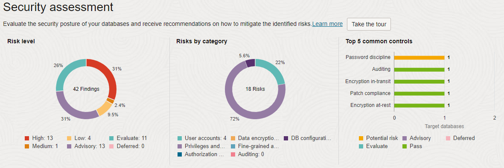
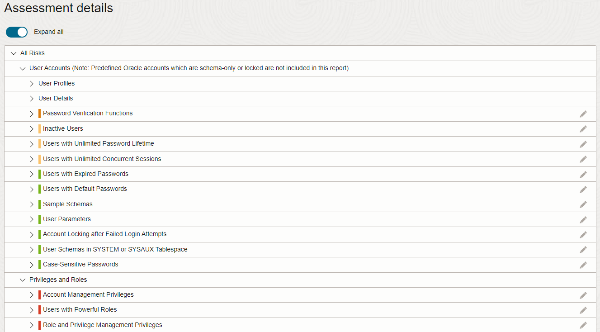
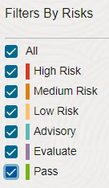
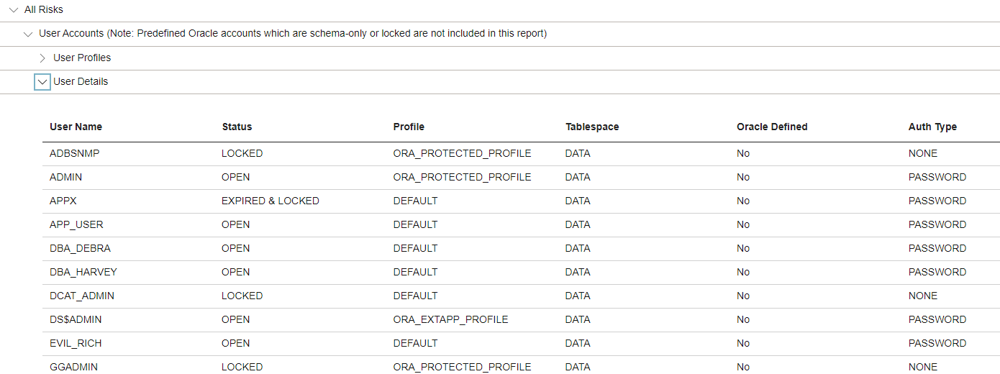
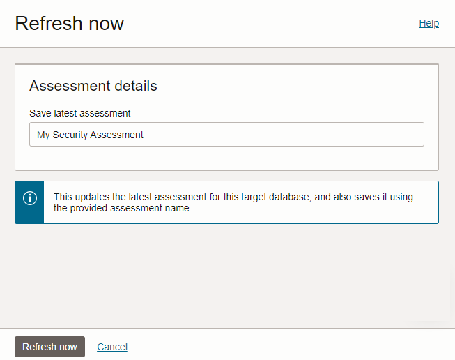
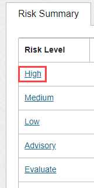
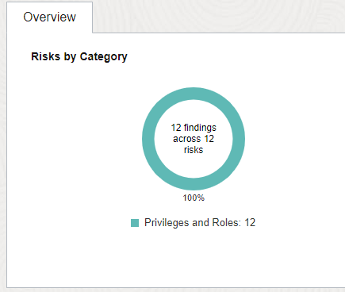
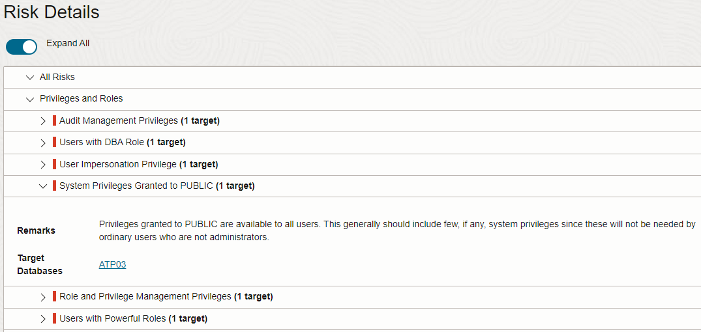
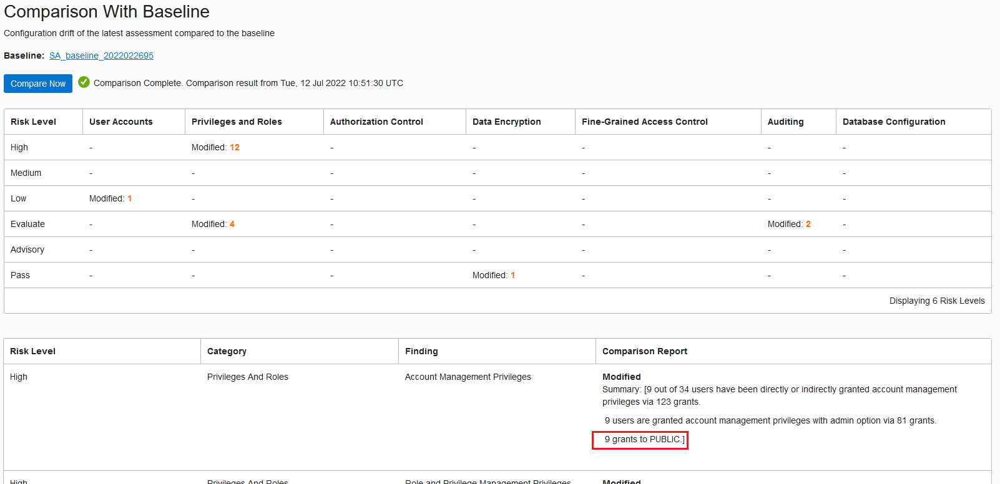
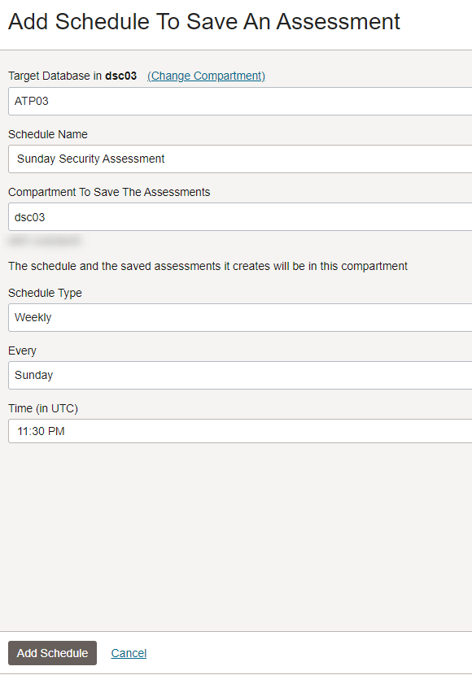

# Assess Database Configurations

## Introduction

Security Assessment helps you assess the security of your database configurations. It analyzes database configurations, user accounts, and security controls, and then reports the findings with recommendations for remediation activities that follow best practices to reduce or mitigate risk. By default, Oracle Data Safe automatically generates security assessments for your target databases and stores them in the Assessment History. You can analyze assessment data across all your target databases and for each target database. You can monitor security drift on your target databases by comparing the latest assessment to a baseline or to another assessment.

In this lab, you explore Security Assessment.

Estimated Lab Time: 20 minutes

### Objectives

In this lab, you will:

- View the dashboard for Security Assessment
- View the latest security assessment for your target database
- Set a baseline assessment
- Generate activity on the target database
- Refresh the latest security assessment and analyze the results
- Generate a Comparison report for Security Assessment
- Add a schedule to save a security assessment for your target database every Sunday at 11:30 PM
- View the history of all security assessments for your target database

### Prerequisites

This lab assumes you have:

- Obtained an Oracle Cloud account and signed in to the Oracle Cloud Infrastructure Console at `https://cloud.oracle.com`
- Prepared your environment for this workshop (see [Prepare Your Environment](?lab=prepare-environment))
- Registered your target database with Oracle Data Safe (see [Register an Autonomous Database with Oracle Data Safe](?lab=register-autonomous-database))
- Started audit data collection for your target database in Oracle Data Safe (see [Audit Database Activity](?lab=audit-database-activity))


### Assumptions

- Your data values are most likely different than those shown in the screenshots.


## Task 1: View the dashboard for Security Assessment

1. In Security Center, click **Security Assessment**.

2. Under **List Scope**, select your compartment. Deselect **Include child compartments**.

    The dashboard shows statistics across all target databases in the selected compartment(s).

3. At the top of the page, review the **Risk Level** and **Risks by Category** charts.

    - The **Risk Level** chart shows you a percentage breakdown of the different risk levels (High, Medium, Low, Advisory, and Evaluate) across all target databases in the selected compartment(s).
    - The **Risks by Category** chart shows you a percentage breakdown of the different risk categories (User Accounts, Privileges and Roles, Authorization Control, Data Encryption, Fine-Grained Access Control, Auditing, and Database Configurations) across target databases in the selected compartment(s).

    


4. View the **Risk Summary** tab.

    - The **Risk Summary** tab shows you how much risk you have across all target databases in the specified compartment(s).
    - You can compare the number of high, medium, low, advisory, and evaluate risk findings across all target databases, and view which risk categories have the greatest numbers.
    - Risk categories include Target Databases, User Accounts, Privileges and Roles, Authorization Control, Fine-Grained Access Control, Data Encryption, Auditing, and Database Configuration.

    

5. Click the **Target Summary** tab and view the information.

    - The **Target Summary** tab shows you the security posture of each target database.
    - You can view the number of high, medium, low, advisory, and evaluate risks for each target database.
    - You can view the assessment date and find out if the latest assessment deviates from a baseline (if one is set).
    - You can access the latest assessment report for each target database.

    

## Task 2: View the latest security assessment for your target database

When you registered your target database, Oracle Data Safe automatically created a security assessment for you.

1. On the **Target Summary** tab, locate the line that has your target database, and click **View Report**.

    The latest security assessment for your target database is displayed. Notice that **Latest assessment for target database** is displayed at the top of the page.

2. Review the table on the **Assessment Summary** tab.

    - This table compares the number of findings for each category in the report and counts the number of findings per risk level (**High Risk**, **Medium Risk**, **Low Risk**, **Advisory**, **Evaluate**, and **Pass**).
    - These values help you to identify areas that need attention.

    


3. To view details about the security assessment itself, click the **Assessment Information** tab.

    - Details include assessment name, OCID, compartment to which the assessment was saved, target database name, target database version, assessment date, schedule (if applicable), name of the baseline assessment (if one is set), and complies with baseline flag (Yes, No, or No Baseline Set).

    


4. Scroll down and view the **Assessment Details** section. If there are no details, move the slider to the left and then to the right.

    - This section shows you all the findings for each risk category.
    - Risks are color-coded to help you easily identify categories that have high risk findings (red).

    


5. Under **Filters By Risks** on the left, notice that you can select the risk levels that you want displayed. Select **Pass**, and then click **Apply**.

    

6. Under **User Accounts**, expand **User Details**.

    - For each user in your target database, the table shows the user status, profile used, the user's default tablespace, whether the user is Oracle Defined (Yes or No), and how the user is authenticated (Auth Type).

    

7. Expand another category and review the findings.

    - Each finding shows you the status (risk level), a summary of the finding, details about the finding, remarks to help you to mitigate the risk, and references - whether a finding is recommended by the Center for Internet Security (**CIS**), European Union's General Data Protection Regulation (**GDPR**), and/or Security Technical Implementation Guide (**STIG**). These references make it easy for you to identify the recommended security controls.
    - In the example below, the **Transparent Data Encryption** finding has two references: **STIG** and **GDPR**.

    


8. Expand a few categories under **Privileges and Roles**, and review the findings.

9. Scroll down further and expand other categories. Each category lists related findings about your target database and how you can make changes to improve its security.

10. At the top of the page, click **View History**. Notice that you have one security assessment listed for your target database. This is a static copy of the latest security assessment.

    

11. Click **Close** to return to the latest security assessment.


## Task 3: Set a baseline assessment

A baseline assessment shows you data for all your target databases in a selected compartment at a given point in time. However, because we are only dealing with one target database in your compartment, the baseline assessment shows data for only your target database.

1. In the breadcrumb at the top of the page, click **Security Assessment**.

2. Under **Related Resources**, click **Assessment History**.

3. Click the name of the first security assessment that Oracle Data Safe generated during target database registration. The names starts with **SA_**.

    

    The security assessment is displayed.

4. Click **Set As Baseline**.

    

    The **Set As Baseline?** dialog box is displayed.

5. Click **Yes** to confirm that you want to set these findings as the baseline.

    *Important! Stay on the page until the message **Baseline has been set** is displayed.*

    

6. In the breadcrumb at the top of the page, click **Assessment History** and confirm that there is a new row in the table for the baseline assessment. If there isn't a baseline, return to the latest assessment and repeat the steps in this task.


## Task 4: Generate activity on the target database

1. Access the SQL worksheet in Database Actions. If your session has expired, sign in again as the `ADMIN` user.

2. If needed, clear the worksheet.

3. On the worksheet, enter the following command and then click the **Run Statement** button on the toolbar (green circle with white arrow).

    ```
    <copy>grant ALTER ANY ROLE to PUBLIC;</copy>
    ```


## Task 5: Refresh the latest security assessment and analyze the results

1. Return to the browser tab for Oracle Data Safe.

2. At the top of the latest security assessment, click **Refresh Now**.

    The **Refresh Now** panel is displayed.

3. In the **Save Latest Assessment** box, enter **My Security Assessment**, and then click **Refresh Now**.

    - This action updates the latest security assessment for your target database and also saves a copy named My Security Assessment in the Assessment History.
    - The refresh operation takes about one minute.

    

4. Click the **Assessment Information** tab and observe that the assessment date and time is right now.

    

5. In the breadcrumb at the top of the page, click **Security Assessment** to return to the dashboard. Make sure your compartment is selected.

6. In the **Risk Level** column, click **High** to view all the high risk findings.

    

7. On the **Overview** tab, review the **Risks by Category** chart. You can position your cursor over the percentage values to view the category name and count.

    

8. In the **Risk Details** section, expand **System Privileges Granted to PUBLIC**. This finding pertains to the grant you made in the previous task.

    - The **Remarks** section explains the risk and how you can mitigate it.
    - The **Target Databases** section lists the target databases to which the high risk applies.

    

8. Click your target database name to view the details about the finding for your target database. The finding includes your target database name, risk level, a summary about the risk, details on your target database, remarks that explain the risk and help you to mitigate it, and references.

    

9. To view the latest assessment for your target database, scroll down to the bottom of the page and click the **click here** link. You are returned to the latest security assessment.

    


## Task 6: Generate a Comparison report for Security Assessment

1. With the latest security assessment displayed, under **Resources** on the left, click **Compare with Baseline**. Oracle Data Safe automatically begins processing the comparison.

    

2. When the comparison operation is completed, review the **Comparison** report.

    - Review the number of findings per risk category for each risk level. Categories include **User Accounts**, **Privileges and Roles**, **Authorization Control**, **Data Encryption**, **Fine-Grained Access Control**, **Auditing**, and **Database Configuration**.
    - You can identify where the changes have occurred on your target database by viewing cells that contain the word **Modified**. The number represents the total count of new, remediated, and modified risks on the target database.
    - In the details table, you can view the risk level for each finding, the category to which the finding belongs, the finding name, and a description of what has changed on your target database. The Comparison Report column is important because it provides explanations of what is changed, added, or removed from the target database since the baseline report was generated.
    - Notice that for the **Account Management Privileges** finding, the details say **9 grants to PUBLIC**.

    


## Task 7: Add a schedule to save a security assessment for your target database every Sunday at 11:30 PM


1. In the breadcrumb at the top of the page, click **Security Assessment**.

2. Under **Related Resources** on the left, click **Schedules**.

    The **Schedules** page is displayed.

3. In the table, notice that a schedule already exists. Its type is LATEST. This is the default schedule that automatically runs a security assessment job on your target database once per week. You can update it and rename it, but you can't delete it.

    

4. Click **Add Schedule**.

    The **Add Schedule To Save An Assessment** panel is displayed.

5. If the compartment shown at the top of the page is not yours, click **Change Compartment** and select your compartment.

6. From the **Target Database** drop-down list, select your target database.

7. In the **Schedule Name** box, enter **Sunday Security Assessment**.

8. From the **Compartment To Save The Assessments** drop-down list, select your compartment.

9. From the **Schedule Type** drop-down list, select **Weekly**.

10. From the **Every** drop-down list, select **Sunday**.

11. Click the **Time** box, scroll down, and select **11:30 PM**. You can manually enter the time too.

12. Click **Add Schedule**.

    

13. Notice that when the schedule is created, its status changes to SUCCEEDED on the **Schedule Details** page.

    


## Task 8: View the history of all security assessments for your target database

1. In the breadcrumb at the top of the page, click **Security Assessment**.

2. Click the **Target Summary** tab.

3. Click the **View Report** link for your target database.

    The latest security assessment is displayed.

4. At the top of the page, click **View History**.

5. Review all the security assessments for your target database.

    - If you don't see your assessments, make sure that your compartment is selected.
    - To view assessments saved to a different compartment, select the compartment from the **Compartment** drop-down list.
    - To also list assessments that were saved to child compartments of the selected compartment, select the **Include child compartments** check box.

6. Review the number of findings for each risk level for your target database.

7. Click **Close**.


## Learn More

- [Security Assessment Overview](https://www.oracle.com/pls/topic/lookup?ctx=en/cloud/paas/data-safe&id=UDSCS-GUID-030B2A14-272F-49CF-80D2-5559C722E0FF)

## Acknowledgements

* **Author** - Jody Glover, Consulting User Assistance Developer, Database Development
* **Last Updated By/Date** - Jody Glover, July 12, 2022
