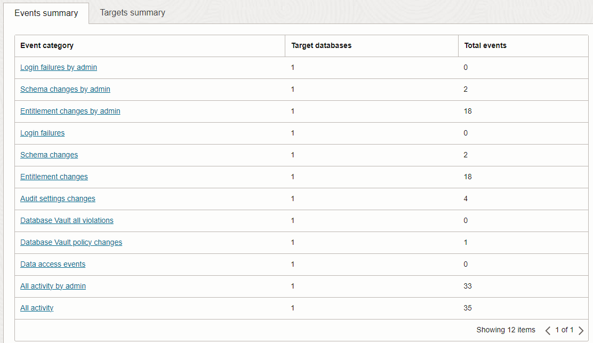
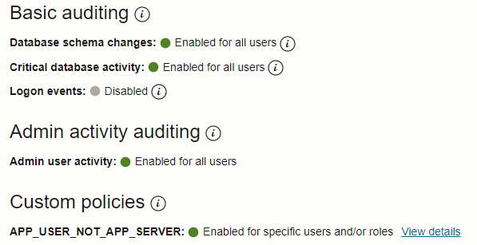
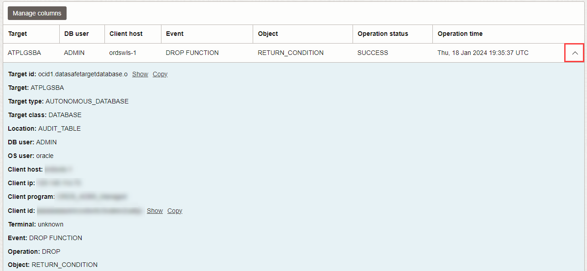
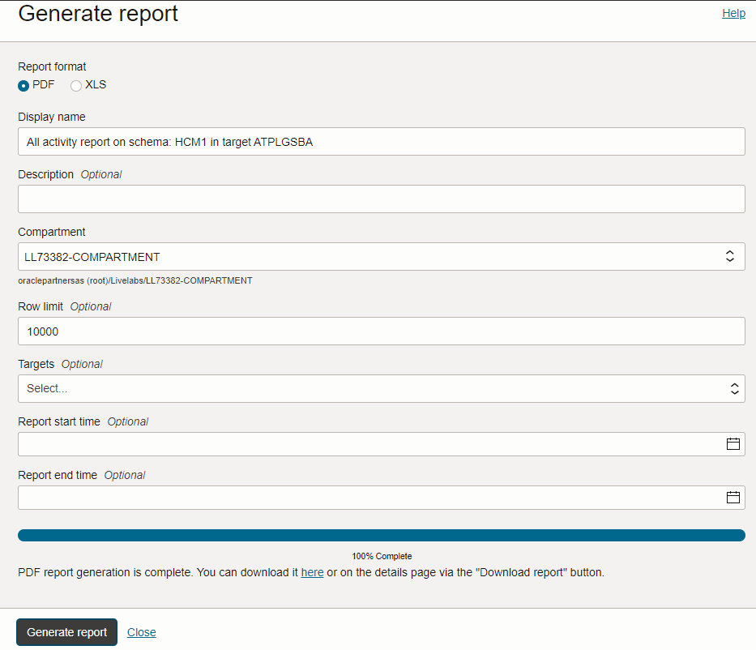
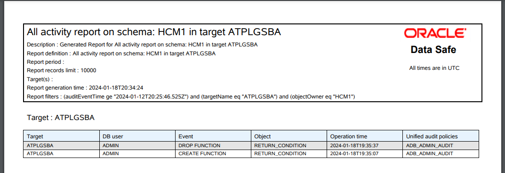
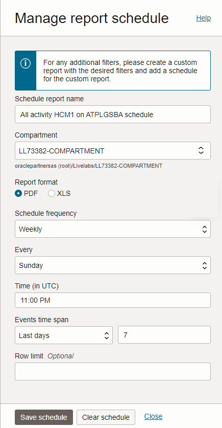

# Audit Database Activity

## Introduction

In Oracle Data Safe, you can provision audit policies on your target databases and collect audit data into the Oracle Data Safe repository. There are basic, administrator, user, Oracle pre-defined, and custom audit policies, as well as audit policies designed to help your organization meet compliance standards. When you register a target database, Oracle Data Safe automatically creates an audit profile, audit policy, and audit trails relevant for the target database.

Start by reviewing the global settings in Oracle Data Safe. Then, review the audit profile, audit trail(s), and audit policy that are automatically created for your target database. Start audit data collection on your target database and provision a few audit policies. Analyze the audit events, view reports, create a custom audit report, and download the custom audit report as a PDF.

Estimated Lab Time: 20 minutes

### Objectives

In this lab, you will:

- Review the global settings for Oracle Data Safe
- Review the audit profile for your target database
- Review the audit policy for your target database
- Review the audit trail(s) for your target database
- View the quantity of audit records available on your target database for the discovered audit trail(s)
- Start audit data collection
- Review the Activity Auditing dashboard
- Provision audit policies on your target database
- Analyze the audit events for your target database
- View the All activity report
- Create a custom audit report
- Generate and download a custom audit report as a PDF
- View the audit report history
- Schedule your custom audit report

### Prerequisites

This lab assumes you have:

- Obtained an Oracle Cloud account
- Signed in to the Oracle Cloud Infrastructure Console
- Prepared your environment for this workshop (see [Prepare Your Environment](?lab=prepare-environment))
- Registered your target database with Oracle Data Safe (see [Register an Autonomous Database with Oracle Data Safe](?lab=register-autonomous-database))


### Assumptions

- Your data values may be different than those shown in the screenshots.
- Please ignore the dates for the data and database names. Screenshots are taken at various times and may differ between labs and within labs. 

## Task 1: Review the global settings for Oracle Data Safe

1. In the breadcrumb at the top of the page, click **Data Safe**.

2. Under **Data Safe**, click **Settings**.

3. Review the global settings.

    - Each regional Oracle Data Safe service in a tenancy has global settings for paid usage, online retention period, and archive retention period.
    - Global settings are applied to all target databases unless their audit profiles override them.
    - By default, paid usage is enabled for all target databases, the online retention period is set to the maximum value of 12 months, and the archive retention period is set to the minimum value of 0 months. Note that you cannot enable paid usage for a free trial account.

    


## Task 2: Review the audit profile for your target database

1. In the breadcrumb at the top of the page, click **Data Safe**.

2. Under **Security center** on the left, click **Activity auditing**.

3. Under **Related resources**, click **Audit profiles**.

4. From the **Compartment** drop-down list under **List scope**, make sure your compartment is selected.

5. On the right, review the audit profile information about your target database, and then click your target database name to view more detail.

    

6. Review the details in the audit profile.

    - There are default settings for paid usage, online retention period, and offline retention period.
    - All initial audit profile settings for your target database are inherited from the global settings for Oracle Data Safe, but you can modify them here as needed.

    

## Task 3: Review the audit trail(s) for your target database

1. In the breadcrumb at the top of the page, click **Activity auditing**.

2. On the left under **Related resources**, click **Audit trails**.

3. Under **List scope** on the left, make sure your compartment is selected.

4. Under **Filters** on the left, select your target database.

5. On the right, review the audit trail(s) for your target database. Oracle Data Safe discovers one audit trail for an Autonomous Database called `UNIFIED_AUDIT_TRAIL`.

    

6. Click your target database name for one of the audit trails and review the information on the **Audit trail information** page. This is where you can manage audit data collection for the audit trail. Notice that the audit trail is currently inactive.

    


## Task 4: Review the audit policy for your target database

1. In the breadcrumb at the top of the page, click **Activity auditing**.

2. Under **Related resources**, click **Audit policies**.

3. From the **Compartment** drop-down list on the left, make sure your compartment is selected.

4. From the **Target databases** drop-down list on the left, select your target database.

5. On the right, review the information provided for your target database's audit policy. Notice that only the **Additional policies** category has policies enabled, which is indicated by a green circle with a check mark. These are Oracle pre-defined policies that are enabled by default on an Autonomous Transaction Processing database.

    

6.  Click your target database name to view more detail on the **Audit policy information** page. Scroll down and review the list of audit policies available for your target database.

    - A grey circle means the audit policy is not yet provisioned on the target database. A green circle means the audit policy is provisioned.
    - You can choose to provision and enable any number of audit policies on your target database and set filters on users and roles.

    


## Task 5: View the quantity of audit records available on your target database for the discovered audit trail(s)

1. In the breadcrumb at the top of the page, click **Activity auditing**.

2. On the left under **Related resources**, click **Audit profiles**.

3. From the **Compartment** drop-down list on the left, make sure your compartment is selected.

4. From the **Target databases** drop-down list on the left, select your target database.

5. On the right, click the name of your target database.

6. Scroll down to the **Compute audit volume** section, and click **Available on target database**.

    The **Compute available volume** dialog box is displayed.

7. For the start date, click the calendar widget and select the current date at 00:00 UTC. You select the current date because your target database is brand new.

8. Click **Compute** and wait for Oracle Data Safe to calculate the available audit volume.
 
9. In the **Available in target batabase** column, view the number of audit records for `UNIFIED_AUDIT_TRAIL`.

    - In our case, the number of records in `UNIFIED_AUDIT_TRAIL` is small because your target database has just been provisioned. For an older target database, however, there are probably a large number of audit records.
    - Oracle Data Safe splits up the numbers by month. These values help you to decide on a start date for the Oracle Data Safe audit trail.
    - Don't worry if the number of audit records on your system is different than what is shown below.

    


## Task 6: Start audit data collection

1. In the breadcrumb at the top of the page, click **Activity auditing**.

2. On the left under **Related resources**, click **Audit trails**.

3. From the **Compartment** drop-down list on the left, make sure your compartment is selected.

4. From the **Target databases** drop-down list on the left, select your target database.

5. On the right, click the name of your target database for `UNIFIED_AUDIT_TRAIL`.

    The **Audit trail information** page is displayed.

6. Click **Start**.

    A **Start audit trail: UNIFIED\_AUDIT\_TRAIL** dialog box is displayed.

7. Configure a start date based on the data in the **Compute audit volume** region of the audit profile that you viewed in task 5 (step 9). For example, if you have one month listed (Jan 2024), you can set the start date to the beginning of January.

    

8. Click **Start**. Wait for **Collection state** to change from **STARTING** to **COLLECTING** and then to **IDLE**. It takes about one minute.

    


## Task 7: Review the Activity Auditing dashboard


1. In the breadcrumb at the top of the page, click **Activity auditing**.

    By default, the Activity Auditing dashboard shows you a summary of audit events for the last one week for all target databases in the form of charts and tables. On the left under **List scope** and **Filters**, you can filter by compartment, time period, and target database.

2. From the **Compartments** drop-down list on the left, make sure your compartment is selected.

3. From the **Target databases** drop-down list on the left, select your target database. The dashboard is automatically updated to include audit event statistics for only your target database.

4. Review the charts.

    - The **Failed login activity** chart shows you the number of failed logins on your target database for the last one week. You may or may not have any failed logins, depending on how you have interacted in Database Actions so far.
    - The **Admin activity** chart shows you the number of database schema changes, logins, audit setting changes, and entitlement changes on your target database for the last one week.
    - The **All activity** chart shows you the total count of audit events on your target database for the specified time period.

    

5. On the **Events summary** tab, review the statistics for audit event categories.

    Statistics include the number of target databases that have an audit event in each event category and the total number of events per category. Because you are viewing statistics for your target database only, the **Target databases** column shows ones.

    

4. Click the **Target summary** tab and review the various audit event counts per target database.

    Audit events include the number of login failures, schema changes, entitlement changes, audit settings changes, all activity (all audit events), Database Vault violations, and Database Vault policy changes.

    

## Task 8: Provision audit policies

1. Under **Related resources**, click **Audit policies**.

2. From the **Compartment** drop-down list on the left, make sure your compartment is selected.

3. From the **Target databases** drop-down list on the left, select your target database.

4. On the right, click the name of your target database.

5. Notice that the following custom audit policies are provisioned on your target database, but not yet enabled:

    - `APP_USER_NOT_APP_SERVER`
    - `EMPSEARCH_SELECT_USAGE_BY_PETE`
    - `ADB_SAAS_ADMIN_AUDIT`
    - `EMP_RECORD_CHANGES`


6. Click **Update and provision**.

    The **Provision audit policies** panel is displayed.

7. Select **Exclude Data Safe user activity**.

8. Under **Basic auditing**, select **Database schema changes** and **Critical database activity**.

9. Under **Admin activity auditing**, select **Admin user activity**.

10. Under **Custom policies**, select **APP\_USER\_NOT\_APP\_SERVER**.

11. Click **Update and provision** to provision the selected policies on your target database.

    

12. Wait for the provisioning to finish, and then view the updated policy information on the page. Notice that the policies you enabled now have green circles.

   


## Task 9: Analyze the audit events for your target database

1. In the breadcrumb at the top of the page, click **Activity auditing**.

2. From the **Target databases** drop-down list on the left, select your target database. 

    The dashboard is automatically updated to include audit event statistics for your target database. Do you notice any difference in the numbers?

    
    

3. Notice that there are schema changes. To investigate, on the **Events summary** tab, click **Schema changes by admin** to view more detail.

4. On the **Event category** page, review the following:

    - The filters set at the top of the page. There are two filters set on **Operation time**, setting the time period for the past one week. There is one filter set on **Target id**, setting the target database to your database.
    - The total number of targets, database users, client hosts, `CREATE` statements, `ALTER` statements, and `DROP` statements
    - The total number of events
    - The individual audit events

    

5. Click the down arrow at the end of any row in the event table to view more detail about the event. When you click the down arrow, it changes to an up arrow.

    

6. What was the SQL issued?

    Answer: Scroll down to the **SQL text** line item. Here you can choose to show the SQL or copy it. The SQL issued was as follows:

    ```
    <copy>drop function HCM1.return_condition</copy>
    ```

## Task 10: View the All activity report

By default, the All activity report shows audit events for the past one week for all target databases in the selected compartment(s).

1. Under **Related resources**, click **Audit reports**. Oracle Data Safe has the following predefined audit reports:

    - All activity
    - Admin activity
    - User/entitlement changes
    - Audit policy changes
    - Login activity
    - Data access
    - Data modification
    - Database schema changes
    - Data Safe activity
    - Database Vault activity
    - Common user activity
    - Database errors
    - Data extraction activity
    - Sensitive data activity
    - SQL Firewall audited violations

2. Make sure that your compartment is selected. Deselect **Include child compartments**.

3. Click the **All activity** report to view it.

4. View the filters set in the report.

    - By default, the report is filtered to show audit events for the past one week for all target databases in the selected compartment(s).
    - You can create additional filters as needed.

5. View the totals in the report.

    - You can click **Targets**, **DB users**, and **Client hosts** to view the list of targets, database users, and client hosts respectively.
    - If you click **DMLs**, **Privilege changes**, **DDLs**, **User/entitlement changes**, **Login failures**, **Login successes**, or **Total events**, the audit events table is filtered accordingly.

6. Scroll down and view the individual audit events.

7. To view more detail for a particular audit event, click the down arrow to expand the row and show details for the particular event. For some details, you can copy their values to the clipboard.

    


## Task 11: Create a custom audit report

1. At the top of the **All activity** report, add the following two filters. To add a filter, click **+ Another filter**. When you are done setting the filter parameters, click **Apply**.

    - **Target = your-target-database-name**
    - **Object owner = HCM1**

2. Click **Manage columns**. In the **Manage columns** panel, select **Target**, **DB user**, **Event**, **Object**, **Operation time**, and **Unified audit policies** columns. Click **Apply changes**. 

    The table displays the selected columns. Also notice that the totals are adjusted too.

    

3. Click **Create custom report**.

    The **Create custom report** dialog box is displayed.

4. Enter the display name **All activity report on schema: HCM1 in target your-target-database-name**. Enter an optional description. Select your compartment, if needed. Click **Create custom report** and wait for the report to generate.

    

5. In the **Create custom report** dialog box, click the **click here** link to navigate to your custom report.

    - If you need to modify your custom report, you can click **Save report** to save the changes.
    - To view your custom report in the future, under **Related resources** for **Activity auditing**, click **Audit reports**. Click the **Custom reports** tab, and then click the name of your custom audit report.


## Task 12: Generate and download a custom audit report as a PDF

1. On the custom audit report page, click **Generate report**.

    The **Generate report** dialog box is displayed.

2. Leave **PDF** selected.

3. Enter the display name **All activity report on schema: HCM1 in target your-target-database-name**.

4. (Optional) Enter a description.

5. Make sure your compartment is selected.

6. Leave the other settings as is.

7. Click **Generate report** and wait until the PDF report is generated. A message is displayed stating that report generation is complete.

      

8. Click the **here** link to download the report.

9. If you are prompted to open or save the report, choose to save.

10. To close the **Generate Report** dialog box, click **Close**.

11. Open the PDF report and view it.

   

12. To close the PDF report, close the browser tab.


## Task 13: View the audit report history

1. Under **Related resources**, click **Audit report history**.

2. View the details for your custom report. On this page, you can click the name of a report to view its details and download the report as a PDF or XLS document (depending on how you originally generated it). Oracle Data Safe keeps the history of audit reports for up to three months.

   

3. In the **Name** column, click the name of your custom report to view its details.

   


## Task 14: Schedule your custom audit report
Schedule your custom audit report to generate a PDF every Sunday at 11PM UTC.

1. In the breadcrumb at the top of the page, select **Activity auditing**.

2. Under **Related resources**, click **Audit reports**.

3. On the right, click the **Custom reports** tab.

4. In the **Report name** column in the table, click the name of your custom report.

    Your custom report is displayed.

5. Click **Manage report schedule**.

    The **Manage report schedule** panel is displayed.

6. Enter a schedule name, for example, **All activity HCM1 on your-database-name schedule**.

7. Make sure that your compartment is selected.

8. Leave **PDF** selected as the report format.

9. For **Schedule frequency**, select **Weekly**.

10. For **Every**, select **Sunday**.

11. For **Time (in UTC)**, select **11 PM**.

12. For **Events time span**, leave **Last days** and **7** as is so that only one weeks worth of data is displayed in the report.

   

13. Click **Save schedule**. 

    The panel closes and you are returned to your custom report.

14. To view the schedule, under **Related resources**, click **Audit reports**. On the right, click the **Custom reports** tab. Notice that now there is a report schedule for your custom report. You can access the reports generated by the schedule on the **Audit report history** page.

    

You may now **proceed to the next lab**.

## Learn More

* [Activity Auditing Overview](https://www.oracle.com/pls/topic/lookup?ctx=en/cloud/paas/data-safe&id=UDSCS-GUID-A73D8630-E59F-44C3-B467-F8E13041A680)
* [View and Manage Audit Reports](https://www.oracle.com/pls/topic/lookup?ctx=en/cloud/paas/data-safe&id=UDSCS-GUID-364B6431-9861-4B42-B24D-103D5F43B44A)

## Acknowledgements

* **Author** - Jody Glover, Consulting User Assistance Developer, Database Development
* **Last Updated By/Date** - Jody Glover, January 18, 2024
