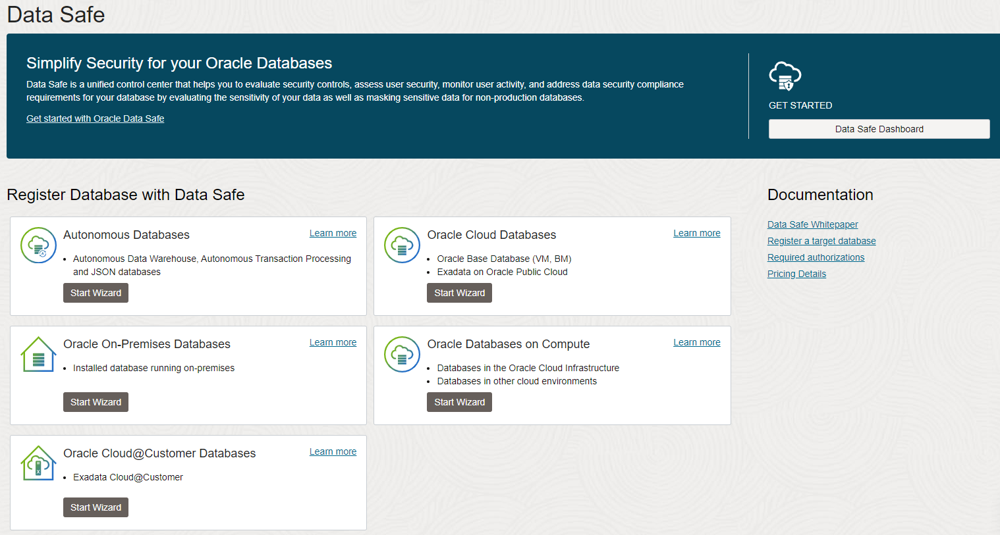
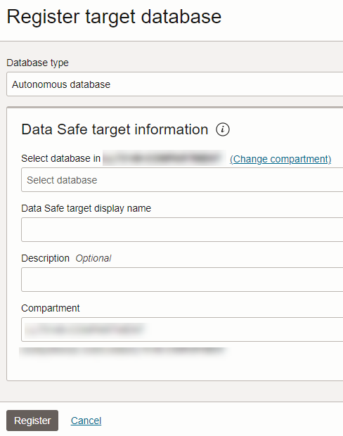
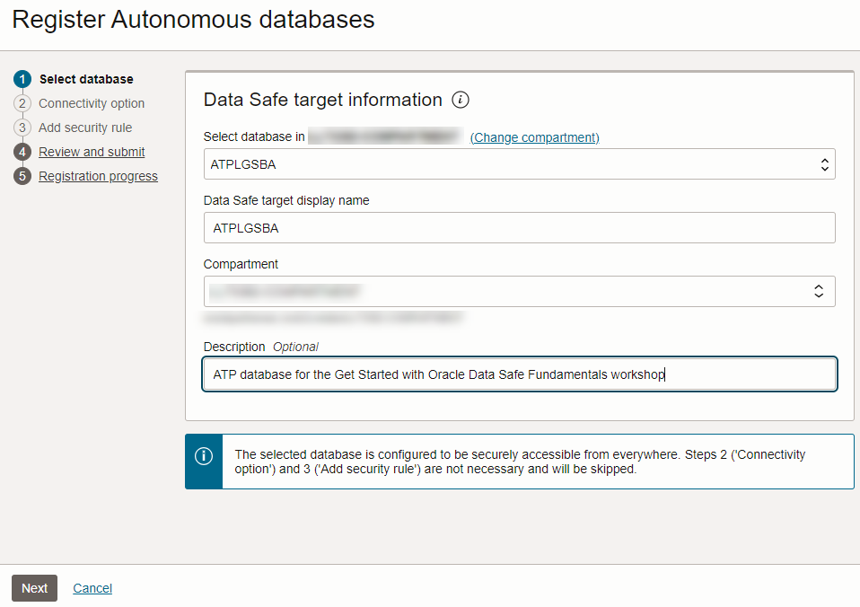
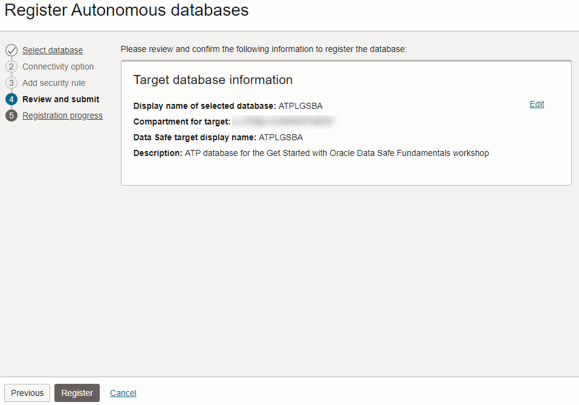
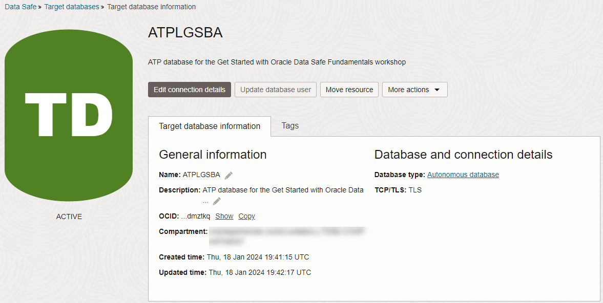
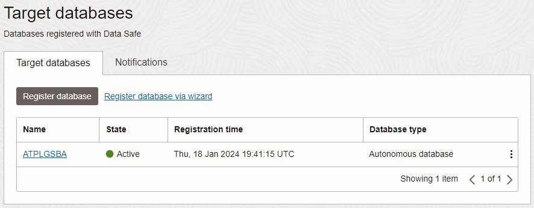
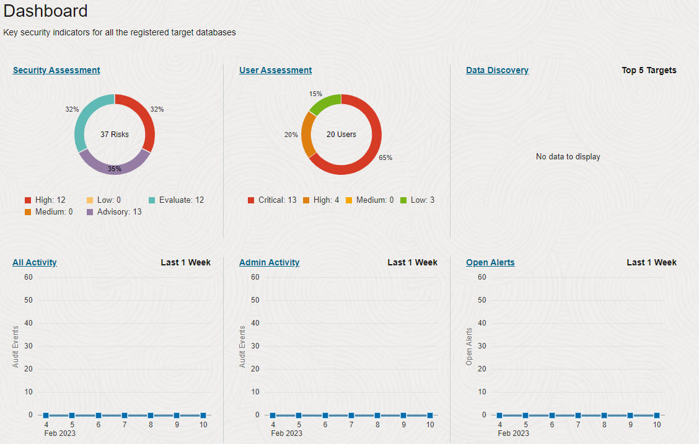
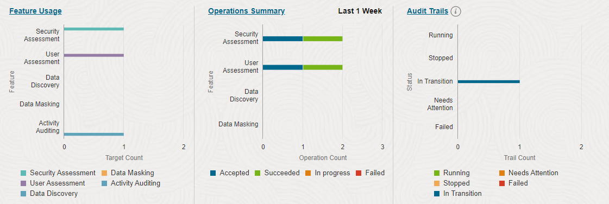

# Register an Autonomous Database with Oracle Data Safe

## Introduction

To use a database with Oracle Data Safe, you first need to register it with Oracle Data Safe. A registered database is referred to as a _target database_ in Oracle Data Safe.

Begin by exploring options for registering target databases, and then register your database using the wizard. Next, navigate to Oracle Data Safe and view the list of registered target databases to confirm that yours is listed. Explore Security Center, which is the central hub for Oracle Data Safe where you can access Security Assessment, User Assessment, Data Discovery, Data Masking, Activity Auditing, Alerts, and the Oracle Data Safe dashboard.

Estimated Lab Time: 10 minutes

### Objectives

In this lab, you will:

- Explore target database registration options
- Register your database with Oracle Data Safe using the wizard
- Access Oracle Data Safe and view your list of registered target databases
- Explore Security Center

### Prerequisites

This lab assumes you have:

- Obtained an Oracle Cloud account
- Prepared your environment for this workshop (see [Prepare Your Environment](?lab=prepare-environment))

### Assumptions

- Your data values are most likely different than those shown in the screenshots.
- Please ignore the dates for the data. Screenshots are taken at various times and may differ between labs and within labs.

## Task 1: Explore target database registration options

You have three options for registering an Autonomous Database on Shared Infrastructure with secure access from everywhere:
- Use the **Register** link on the **Autonomous Database details** page (one-click method with no interaction).
- Use the Autonomous Databases wizard on the **Overview** page for the Oracle Data Safe service (guided method with customization options).
- Manually register your target database from the **Registered Targets** page (advanced method without guidance).

1. Return to the **Autonomous Database | Oracle Cloud Infrastructure** browser tab. You last left off on the **Autonomous Database details** page.

    If you navigated away from this page: From the navigation menu, select **Oracle Database**, and then **Autonomous Transaction Processing**. Select your compartment (if needed), and then click the name of your database.

2. Scroll down the page, and then under **Data Safe**, notice that there is a **Register** option. Please don't click the link, and instead, lets view the other options.

    

3. From the navigation menu, select **Oracle Database**, and then **Data Safe**. The **Overview** page is displayed. On this page, there are wizards to register the following types of databases. For an Autonomous Database on Shared Infrastructure with secure access from everywhere, you use the Autonomous Databases wizard.

    - Autonomous Databases
    - Oracle Cloud Databases
    - Oracle On-Premises Databases
    - Oracle Databases on Compute
    - Oracle Cloud@Customer Databases

    

4. Under **Data Safe** on the left, click **Target Databases**. 

5. On the right, click **Register Database**. From here, you can configure registration details. This method assumes that you have already completed the required pre-registration tasks for your database.

   

6. Click **Cancel**.

## Task 2: Register your database with Oracle Data Safe using the wizard

To register a database other than an ATP database for this workshop, please follow the registration instructions specific for your database type in the _Administering Oracle Data Safe_ guide. See the **Learn More** section at the bottom of this page.

1. Click **Register Database via Wizard**.

    The **Overview** page is displayed.

2. On the **Autonomous Databases** tile, click **Start Wizard**. 

    The first page in the wizard called **Select Database** is displayed.

3. From the first drop-down list, select your database. If needed, click **Change Compartment**, select your compartment, and then select your database. 

4. (Optional) Change the default display name for your target database. This name is displayed in your Oracle Data Safe reports. 

5. (Optional) Select a different compartment in which to save the target database. Usually you select the compartment in which your database resides.

6. (Optional) Enter a description for your target database. 

7. Notice the message at the bottom of the page: **The selected database is configured to be securely accessible from everywhere. Steps 2 ('Connectivity Option) and 3 ('Add Security Rule') are not necessary and will be skipped.** If your database has a private IP address, you need to configure an Oracle Data Safe private endpoint and security rules. 

    

8. Click **Next**.    

9. On the **Review and Submit** page, review the information. To make a change, you can return to the **Select Database** page. 

    

10. Click **Register**.

    The **Registration Progress** page is displayed briefly, and then the **Target Database Details** page is displayed. 

11. Wait for the target database status to turn to **ACTIVE**, which means your target database is fully registered. Next, review the information and options provided on the page.

    - You can view/edit the target database name and description.
    - You can view the Oracle Cloud Identifier (OCID), when the target database was registered, the compartment name to where the target database was registered, the database type (Autonomous Database), and the connection protocol (TLS). The information varies depending on the target database type.
    - You have options to edit connection details (change the connection protocol), move the target database to another compartment, deregister the target database, and add tags.

    
    

## Task 3: Access Oracle Data Safe and view your list of registered target databases

1. In the breadcrumb at the top of the page, click **Target Databases**.

2. Under **List Scope**, make sure your compartment is selected. Your registered target database is listed on the right.

    - A target database with an **ACTIVE** status means that it is currently registered with Oracle Data Safe.
    - A target database with a **DELETED** status means that it is no longer registered with Oracle Data Safe. The listing is removed 45 days after the target database is deregistered.

    

## Task 4: Explore Security Center

1. In the breadcrumb at the top of the page, click **Data Safe**.

    The **Overview** page is displayed.

2. Under **Security Center** on the left, click **Dashboard** and review the dashboard. Scroll down to view all the charts. Make sure your compartment is selected under **List Scope**. From the **Target Databases** drop-down list, select your target database so that the data in the dashboard pertains to your target database only.

    - In Security Center, you can access all the Oracle Data Safe features, including the dashboard, Security Assessment, User Assessment, Data Discovery, Data Masking, Activity Auditing, and Alerts.
    - When you register a target database, Oracle Data Safe automatically creates a security assessment and user assessment for you. That's why the **Security Assessment**, **User Assessment**, **Feature Usage**, and **Operations Summary** charts in the dashboard already have data.
    - During registration, Oracle Data Safe also discovers audit trails on your target database. That's why the **Audit Trails** chart in the dashboard shows one audit trail with the status **In Transition** for your Autonomous Database. Later you start this audit trail to collect audit data into Oracle Data Safe.

    

    

## Learn More

- [Target Database Registration](https://www.oracle.com/pls/topic/lookup?ctx=en/cloud/paas/data-safe&id=ADMDS-GUID-B5F255A7-07DD-4731-9FA5-668F7DD51AA6)
- [Oracle Data Safe Dashboard](https://www.oracle.com/pls/topic/lookup?ctx=en/cloud/paas/data-safe&id=ADMDS-GUID-B4D784B8-F3F7-4020-891D-49D709B9A302)

## Acknowledgements

- **Author** - Jody Glover, Consulting User Assistance Developer, Database Development
- **Last Updated By/Date** - Jody Glover, February 22, 2023
