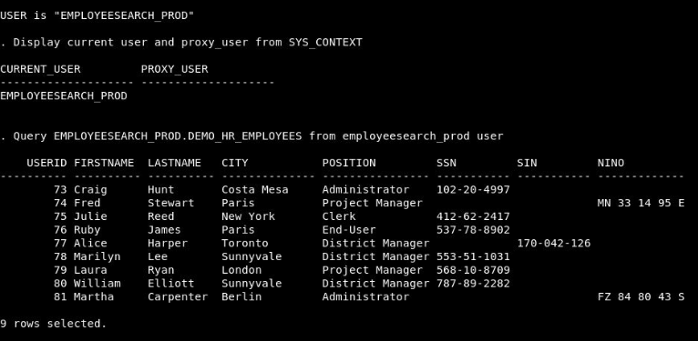
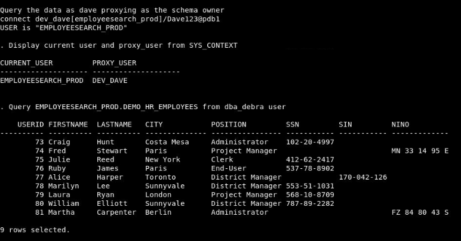
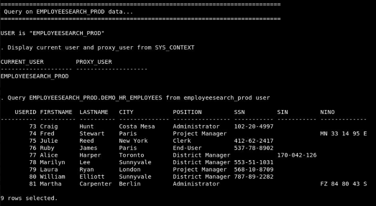
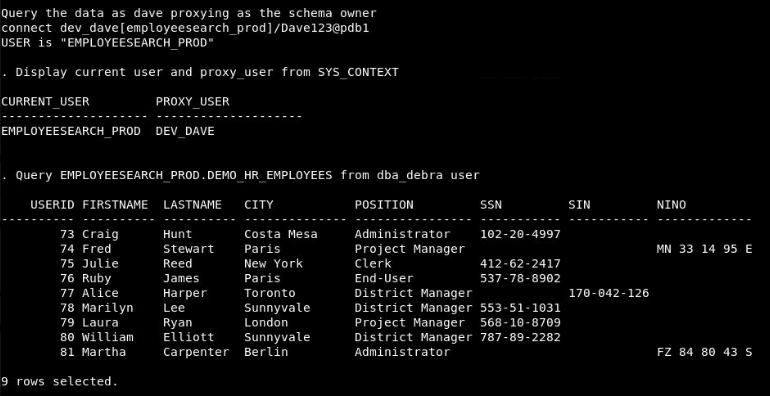
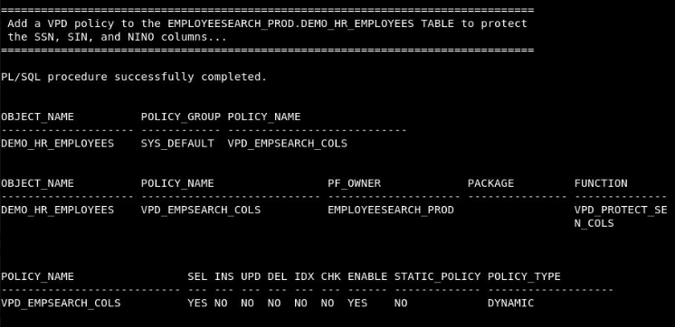
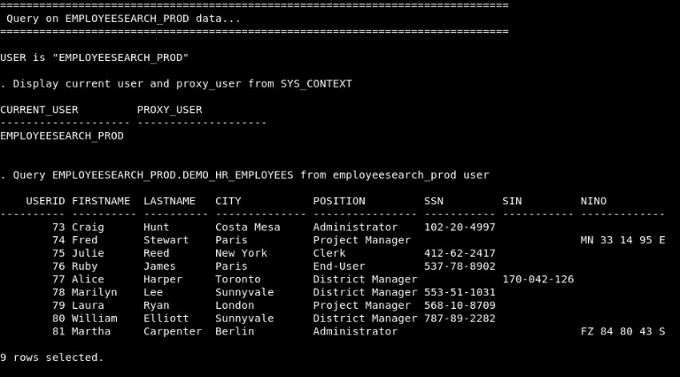
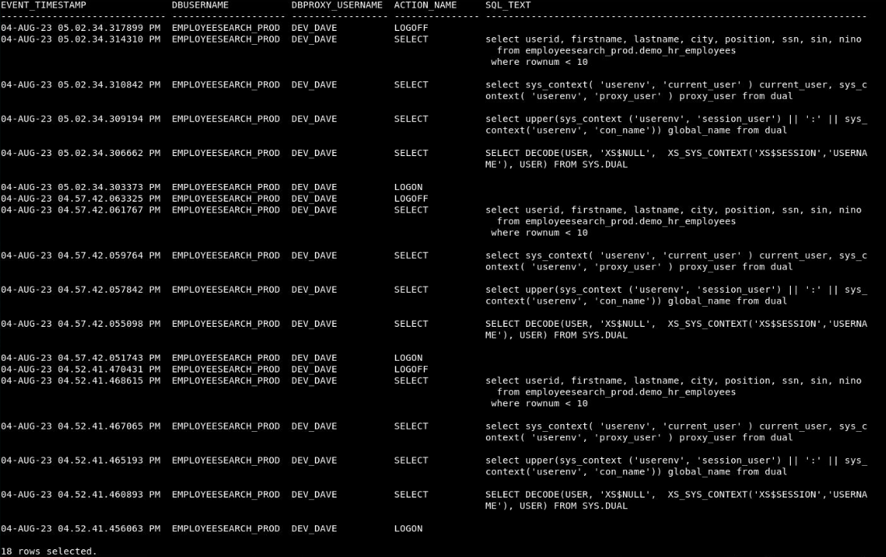
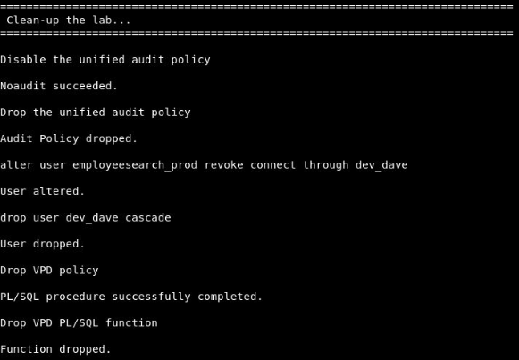

# How Developers Could Use Oracle Database Proxy Authentication

## Introduction
This workshop introduces the functionality of Proxy Authentication in Oracle's Database.

Description: Proxy Authentication allows a user (the proxy user) to connect to the database on behalf of another user (the target user) and this workshop show developers the proper usage, configuration and best practices with Proxy Authentication. 

*Estimated Lab Time:* 30 minutes

*Version tested in this lab:* Oracle DB 19.17

### Objectives
Allow a developer to access the application data without knowing the application schema password.  The developer created will inherit the privileges of the application schema.

### Prerequisites

This lab assumes you have:
- A Free Tier, Paid or LiveLabs Oracle Cloud account
- You have completed:
    - Lab: Prepare Setup (*Free-tier* and *Paid Tenants* only)
    - Lab: Environment Setup
    - Lab: Initialize Environment

## Task 1: Download proxy.tar file to local directory.

1.  Open a Terminal session on your **DBSec-Lab** VM as OS user *oracle* and use `cd` command to move to livelabs directory.

    ````
    <copy>cd livelabs</copy>
    ````

    **Note**: If you are using a remote desktop session, double-click on the *Terminal* icon on the desktop to launch a session

2.  Use the Linux command 'wget' to download a bundled (zipped) file of the commands for the lab. 

    ````
    <copy>wget https://objectstorage.us-ashburn-1.oraclecloud.com/p/ZSKnVs6L8sGvA4HkZJjxv2sEFuf-30BYhE1F6jMHeltJ0icC-CBtLUKZzVwNObww/n/oradbclouducm/b/dbsec_rich/o/proxy.tar</copy>
    ````

3.  Unarchive the downloaded tar to expand the directory and scripts.

    ````
    <copy>tar xvf proxy.tar</copy>
    ````

4.   Use `cd` command to move to proxy directory.
    
    ````
    <copy>cd proxy</copy>
    ````

5.   Use `ls` command to list files. 
    
    ````
    <copy>ls</copy>
    ````
## Task 2: Proxy Lab

1.  First, create the developer, `DEV_DAVE`, account. Note that it has no privileges. This account cannot authenticate unless it is proxying as another account.

    ````
    <copy>./proxy_create_dave.sh</copy>
    ````
    **Output:**
    
    

2.   Authorize the `DEV_DAVE` account to proxy as if it were the `EMPLOYEESEARCH_PROD` application schema.

    ````
    <copy>./proxy_auth_dave.sh</copy>
    ````
    **Output:**
    
    

3.  Create a Unified Audit policy to audit when proxying users access sensitive data in the `EMPLOYEESEARCH_PROD.DEMO_HR_EMPLOYEES` table.

    ````
    <copy>./proxy_create_audit_policy.sh</copy>
    ````
    **Output:**

    

4.   Remember, you must enable a Unified Audit policy after creating it. This allows you to stage, or prepare, policies in advance.
    
    ````
    <copy>./proxy_enable_audit_policy.sh</copy>
    ````
    **Output:**

    

5.    Verify that `DEV_DAVE` cannot authenticate. This account has no privileges, it will inherit privileges from `EMPLOYEESEARCH_PROD` when it proxies as that user.
    
    ````
    <copy>./proxy_test_as_dave.sh</copy>
    ````
    **Output:**
    
    

6.  Now, demonstrate that `DEV_DAVE` can proxy as `EMPLOYEESEARCH_PROD`. Dave does not need to know the `EMPLOYEESEARCH_PROD` password, Dave uses his own password. Notice the user information shows the `EMPLOYEESEARCH_PROD` schema. We can verify the proxy user by querying the SYS_CONTEXT attribute `proxy_user`.
    
    ````
    <copy>./proxy_query_employee_data.sh</copy>
    ````
    **Output:**

    

    

7.  View the audit data created by the proxy user `DEV_DAVE`.
    
    ````
    <copy>./proxy_view_audit.sh</copy>
    ````
    **Output:**

    

## Task 3: Optional Lab

In this lab, you will demonstrate how you can add additional security factors based on whether the database user is a proxying user or not.  We will prevent proxying users, like `DEV_DAVE` from viewing the social identifier columns (`SSN`, `SIN`, `NINO`) in `EMPLOYEESEARCH_PROD.DEMO_HR_EMPLOYEES`. The schema, without a proxy user, should be able to view these sensitive columns.  Create an Oracle Virtual Private Database (VPD) policy, sometimes called row-level security or fine-grain access control, to prevent the social identifier columns from being returned to proxy users. They will return as null values.

1.   Demonstrate the sensitive column data is displayed for both `EMPLOYEESEARCH_PROD` and `DEV_DAVE`.
    
    ````
    <copy>./proxy_query_employee_data.sh</copy>
    ````
    **Output:**

    

    

2.  Verify there are no current Oracle Virtual Private Database (VPD) policies on our table.
    
    ````
    <copy>./proxy_vpd_query_policies.sh</copy>
    ````
    **Output:**

    

3.  Create a PL/SQL function to identify `EMPLOYEESEARCH_PROD` session_user and if the session user is a proxying user. If it is only the schema, the function will not add a predicate to the SQL query. If the session user is a proxying user, it will add `1=0` to the SQL query and return `SSN`, `SIN`, and `NINO` columns as null values.
    
    ````
    <copy>./proxy_vpd_create_function.sh</copy>
    ````

4.  Create the policy to apply to the `EMPLOYEESEARCH_PROD.DEMO_HR_EMPLOYEES` table.
    
    ````
    <copy>./proxy_vpd_create_policy.sh</copy>
    ````
    **Output:**
    
    

5.  Verify the `EMPLOYEESEARCH_PROD` schema is able to view the social identifier columns but the proxying user is not.
    
    ````
    <copy>./proxy_query_employee_data.sh</copy>
    ````
    **Output:**

    

    

6.  View the audit data related to our proxy user queries. Notice the Oracle VPD predicate (`RLS_INFO`) data is available in the Unified Audit trail. You can see the policy type and policy predicate that was applied to the proxying user’s SQL query.
    
    ````
    <copy>./proxy_view_audit.sh</copy>
    ````
    **Output:**
    
    

## Task 4: Clean up. 

1.  Remove the PL/SQL functions and clean up the proxy.
    
    ````
    <copy>./proxy_cleanup.sh</copy>
    ````
    **Output:**

    

## **Appendix**: About the Product
### **Overview**

Proxy Authentication allows a user (the proxy user) to connect to the database on behalf of another user (the target user) and this workshop show developers the proper usage, configuration and best practices with Proxy Authentication. 

## Learn More
Technical Documentation:
- [Proxy Authentication](https://docs.oracle.com/en/database/oracle/oracle-database/19/jjdbc/proxy-authentication.html#GUID-07E0AF7F-2C9A-42E9-8B99-F2716DC3B746)

- [Oracle Database 19c Security Guide](https://docs.oracle.com/en/database/oracle/oracle-database/19/dbseg/index.html#Oracle%C2%AE-Database)

## Acknowledgements
- **Author** - Stephen Stuart & Noah Galloso, Solution Engineers, North America Specialist Hub
- **Contributors** - Richard C. Evans, Database Security Product Manager 
- **Last Updated By/Date** - Stephen Stuart & Noah Galloso, August 2023
