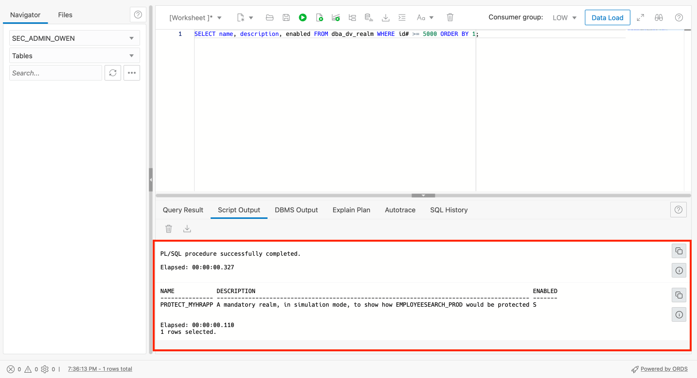
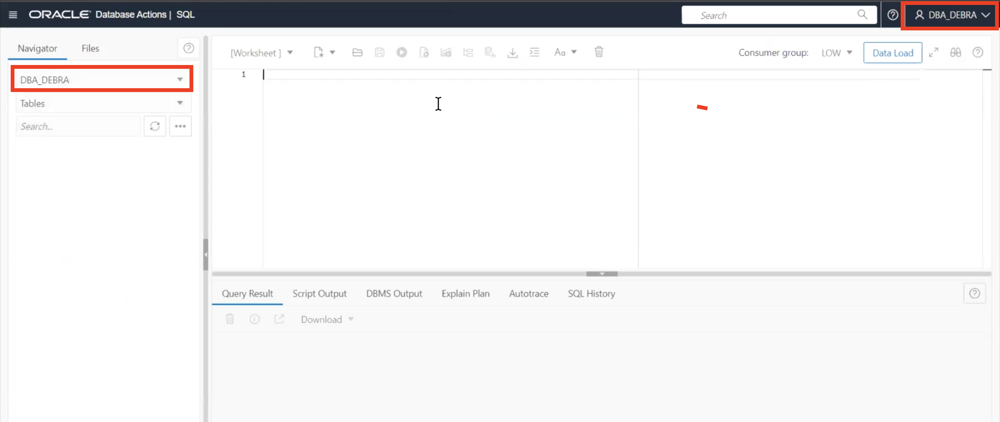
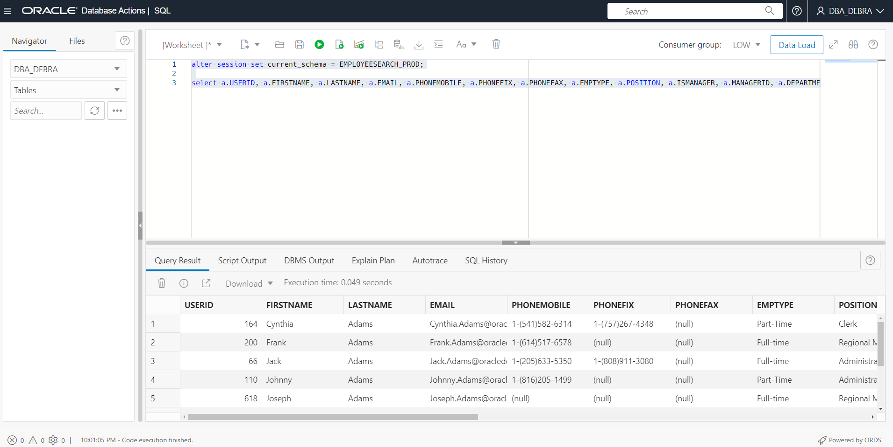
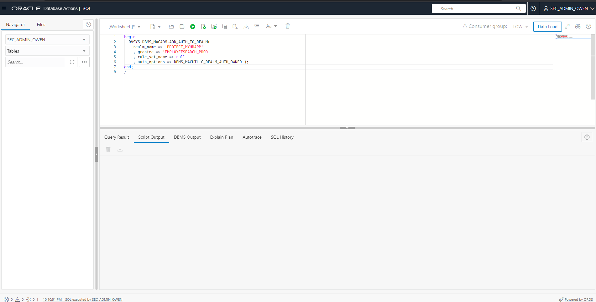
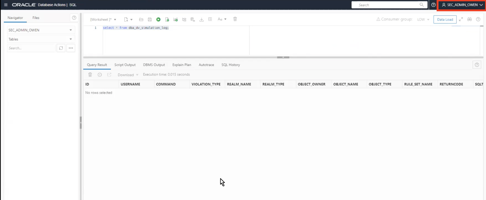

# Identify the connections to the EMPLOYEESEARCH_PROD schema

## Introduction

In this lab, we will explore creating a realm in our ATP instance. We will keep our realm in **simulation mode**. In turn, this will enable us to capture a record of errors during the development phase of a realm or command rule. Using simulation mode, we will then identify our connections to the `EMPLOYEESEARCH_PROD` schema.

### Objectives

In this lab, you will complete the following tasks:

- Create a Database Vault realm.
- Use **simulation mode** to identify the connections to the `EMPLOYEESEARCH_PROD` schema (app versus non-app connections).

### Prerequisites

This lab assumes you have:
- Oracle Cloud Infrastructure (OCI) tenancy account
- Completion of the following previous labs: Configure the Autonomous Database instance, Connect to the legacy Glassfish HR application, Load and verify the data in the Glassfish application, Enable Database Vault and verify the HR application

## Task 1: Create a Database Vault realm

1. Navigate back to your **Database Actions SQL Worksheet**. Under the menu bar for `ADMIN` at the top right select **Sign out**. Sign back into Database Actions under the user `sec_admin_owen` and select **SQL** under **Development**. Make sure the worksheet is clear and your schema is updated from **ADMIN** to `SEC_ADMIN_OWEN`.

	

2. Copy and paste the following script to the SQL worksheet to create a Database Vault realm `PROTECT_MYHRAPP` in order to protect `EMPLOYEESEARCH_PROD`. Select the **Run Script** button to execute the script. Check the script output at the bottom to make sure the script executed successfully.

	```
	<copy>BEGIN
			DVSYS.DBMS_MACADM.CREATE_REALM(
				realm_name => 'PROTECT_MYHRAPP'
				,description => 'A mandatory realm, in simulation mode, to show how EMPLOYEESEARCH_PROD would be protected'
				,enabled => DBMS_MACUTL.G_SIMULATION
				,audit_options => DBMS_MACUTL.G_REALM_AUDIT_FAIL
				,realm_type => 1); 
		END;
		/</copy>
	```

	

3. Clear your SQL worksheet. Copy and paste the following query and check the output to show the current Database Vault Realm was created. 

	```	
	<copy>SELECT name, description, enabled FROM dba_dv_realm WHERE id# >= 5000 ORDER BY 1;</copy>
    ```

	

4. Clear your SQL worksheet. Copy and paste the following script to add the `EMPLOYEESEARCH_PROD` schema, and all its objects to the `PROTECT_MYHRAPP` Database Vault realm. This applies to existing and any new objects created within the `EMPLOYEESEARCH_PROD` schema. Check the output to see that the script executed successfully.

	```
    <copy>BEGIN
       DVSYS.DBMS_MACADM.ADD_OBJECT_TO_REALM(
           realm_name   => 'PROTECT_MYHRAPP',
           object_owner => 'EMPLOYEESEARCH_PROD',
           object_name  => '%',
           object_type  => '%');
    END;
    /</copy>
	```
    
	In the next task, we are going to capture access to objects in the `EMPLOYEESEARCH_PROD` schema, including access by the schema itself. This will help us understand which objects are available and where they are retrieved from. 

5. Navigate back to your **HR Production** application and log out, then log back in as **hradmin**. Check to see that the data still appears and is available. Click through the employee profile menu tabs to ensure all data is present.

	

	

	


## Task 2: Use simulation mode to identify the connections to the EMPLOYEESEARCH_PROD schema

1. As `SEC_ADMIN_OWEN`, copy and paste the following query to look at the `dba_dv_simulation_log`. Ensure that `EMPLOYEESEARCH_PROD` is the **Object Owner**. Notice how the schema `EMPLOYEESEARCH_PROD` is labeled as a **Realm Violation**. We will be configuring Database Vault so that `EMPLOYEESEARCH_PROD` is the only schema that is able to access the data.
	
	```
	<copy>select * from dba_dv_simulation_log;</copy>
	```

	

2. Under the menu bar for `SEC_ADMIN_OWEN` at the top right select **Sign out**. Sign back into Database Actions under the user `dba_debra` and select **SQL** under **Development**. Make sure the worksheet is clear and your schema is updated to `DBA_DEBRA`.

	

3. Copy and paste the following commands to query the `DEMO_HR_EMPLOYEES` table under the `EMPLOYEESEARCH_PROD` schema.

	```
	<copy>alter session set current_schema = EMPLOYEESEARCH_PROD;</copy>
	```

	```
	<copy>select a.USERID, a.FIRSTNAME, a.LASTNAME, a.EMAIL, a.PHONEMOBILE, a.PHONEFIX, a.PHONEFAX, a.EMPTYPE, a.POSITION, a.ISMANAGER, a.MANAGERID, a.DEPARTMENT, a.CITY, a.STARTDATE, a.ENDDATE, a.ACTIVE, a.COSTCENTER, b.FIRSTNAME as MGR_FIRSTNAME, b.LASTNAME as MGR_LASTNAME, b.USERID as MGR_USERID from DEMO_HR_EMPLOYEES a left outer join DEMO_HR_EMPLOYEES b on a.MANAGERID = b.USERID where 1=1 order by a.LASTNAME, a.FIRSTNAME</copy>
	```

	

	Notice how DBA is able to query objects found in the EMPLOYEESEARCH_PROD schema, the same data that is displayed in the HR application. This is an example of what we will prohibit when we switch the Database Vault realm from simulation to enforcement mode. This will also disable access for privileged users, like `ADMIN`, and users with the `PDB_DBA` role


4. Log out of `DBA_DEBRA` and log back into database actions as `SEC_ADMIN_OWEN`. Under **Developemnt**, select **SQL**. Copy, paste, and run the following command to query the `dba_dv_simulation_log` table.

	```
	<copy>select username, violation_type, realm_name, object_owner, object_name, client_ip, dv$_module, dv$_client_identifier from dba_dv_simulation_log;</copy>
	```

	

	This query displays all the recent usage and connections to objects under the database vault realm that was created. Notice how there are connections from users like `DBA_DEBRA, SEC_ADMIN_OWEN, and ADMIN`. These users besides for `EMPLOYEESEARCH_PROD` will be prohibited once we provide realm authorization to `EMPLOYEESEARCH_PROD`. Note the `DV$_MODULE` column as well. This shows the connection methods to the `EMPLOYEESEARCH_PROD` objects. The only connection we will trust is the connections coming from `JDBC Thin Client` which is the HR application connection. All other connections will be banned using the created realm. 

5. Clear the `dba_dv_simulation_log` table using the following commands. 

	```
	<copy>delete from dvsys.simulation_log$;</copy>
	```

	```
	<copy>commit;</copy>
	```

6. Make sure your SQL worksheet is clear. Copy, paste, and run the following PL*SQL block to add realm `EMPLOYEESEARCH_PROD` as an authorized participant in the `PROTECT_MYHRAPP` realm.  This allows the `EMPLOYEESEARCH_PROD` schema to access its own objects without showing as a Realm Violation in the simulation logs and ensures it can access the objects when we switch from simulation mode to enforcement mode.

	```
	<copy>
	begin
		DVSYS.DBMS_MACADM.ADD_AUTH_TO_REALM(
			realm_name => 'PROTECT_MYHRAPP'
			, grantee => 'EMPLOYEESEARCH_PROD'
			, rule_set_name => null
			, auth_options => DBMS_MACUTL.G_REALM_AUTH_OWNER); 
	end;
	/</copy>
	```

	

7. Navigate back to the **HR production application** and log out then log back in as **hradmin**. Take another look at the employee data to make sure it is still present and the application is still functioning properly.

	

	

8. Open back up **Database Actions** in Oracle Cloud. As `sec_admin_owen`, copy, paste, and run the following command to query the `dba_dv_simulation_log` table.

	```
	<copy>select * from dba_dv_simulation_log;</copy>
	```

	

	Now that we added realm authorization to `EMPLOYEESEARCH_PROD`. Incoming connections from the **JDBC client** or the HR application no longer qualies as a realm violation because now they are a trusted user and connection.  

9. Relocate the cloud shell console. Use te following commands to run the `dv_query_employee_search.sh` script as **ADMIN**.

	*Note: If you have been logged out of your Glassfish instance due to inactivity, use the following command to log back in. Public IP address can be found on the instance details dashboard on Oracle Cloud:*

	```
	<copy>chmod 600 myhrappkey</copy>
	```

	```
    <copy>ssh -i myhrappkey opc@<PASTE INSTANCE PUBLIC IP ADDRESS HERE></copy>
    ```

	Here are the commands for running `dv_query_employee_search.sh`:

	```
	<copy>cd cd secure-legacy-app-db-vault</copy>
	```

	```
	<copy>./dv_query_employee_search.sh</copy>
	```

	

10. Minimize Cloud Shell and navigate back to your **Database Actions** tab in Oracle Cloud. As `sec_admin_owen`, copy, paste, and run the following command to query the `dba_dv_simulation_log` table again.

	```
	<copy>select * from dba_dv_simulation_log;</copy>
	```

	

Because `ADMIN` accessed `EMPLOYEESEARCH_PROD` database objects, it will show as a Realm Violation in the Database Vault simulation log. Next, we will move the realm from **simulation to enforcement mode** and see that privileged users, like `ADMIN` and `DBA_DEBRA`, will no longer have sufficient privileges to query `EMPLOYEESEARCH_PROD` objects

You may now **proceed to the next lab.**

## Learn more
- [Configuring Database Vault Realms](https://docs.oracle.com/database/121/DVADM/cfrealms.htm#DVADM003)
- [Oracle Databse Vault Simulation Mode](https://docs.oracle.com/en/database/oracle/oracle-database/12.2/dvadmusing-training-mode-to-log-realm-and-command-rule-activities.html)

## Acknowledgements

- **Author**- Ethan Shmargad, North America Specialists Hub
- **Creator**- Richard Evans, Senior Principle Product Manager
- **Last Updated By/Date** - Ethan Shmargad, September 2022