# Deploy the stack to install and EBS, EBS Asserter and Identity Domain

## Introduction

Using this stack we will be able to deploy/install **EBS - 12.2.11, EBS Asserter Server and Identity Domain**. The Identity Domain created will be of the type **Oracle Apps Premium**. On the EBS application, we will configure EBS with **Web Entry Point** and a few demo users.

## Objectives

1.	Deploy and configure **EBS Application**
2. 	Deploy **EBS Asserter Server**
3.	Deploy the **Identity Domain** of the type **Oracle Apps Premium**
4.	Validate the created resources via web browser and via SSH access.

## Task 1: Deploy the Stack via Resource Manager

1. Once logged in to the OCI Console, navigate to **Developer Services** then select **Stacks** under **Resource Manager**. Now click on **Create Stack**

**Note** Please do not select the **Root** compartment while creating the stack

	

 
2. On the Create Stack Wizard, select the **.zip** option and then browse to upload the **Deploy** stack that you downloaded in the previous lab. Now click on **Next**

	
	
	
	
	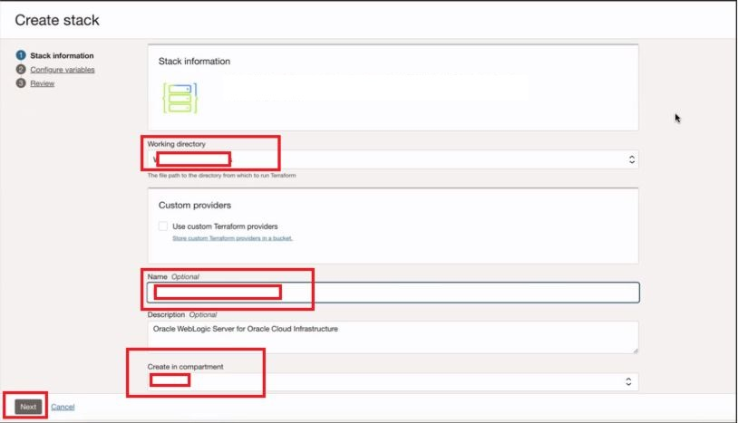
	
**Note** The stack automatically picks up the working directory, provides the stack with a name and the working compartment gets selected. The Stack Name and Compartment can be changed if required.

3. Now, on the **Configure variables** section, upload your **SSH Public Key**. Make sure that **OCI Policies** is checked 

	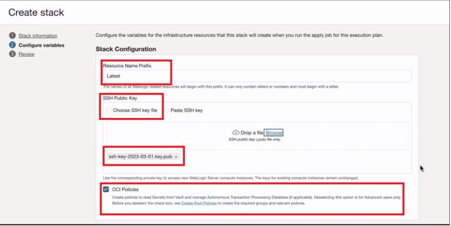
	
**Note** SSH Public Key needs to generated as a prerequisites.	
	
4. In the **Virtual Cloud Networking** section, select the **Network Compartment** that has your existing **VCN**, then select the **Subnet Compartment**  which has your existing **Public Subnet**. Select **Regional Subnet** on the **Subnet Span** option and select the existing regional subnet under **Existing Subnet for Weblogic Server**

	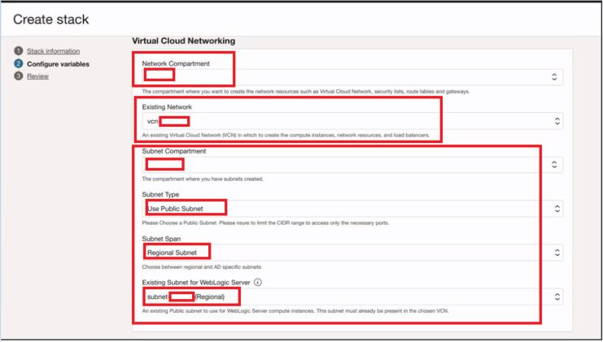	
	
5. In the **Weblogic Domain Configuration** provide the **Weblogic Credentials** and select **jdk8** under **Java development Kit** option.

	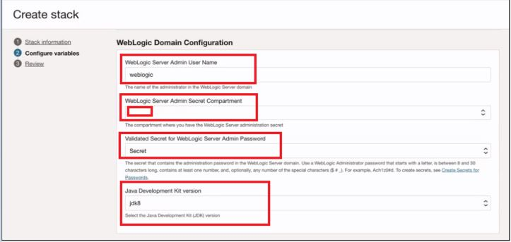	

**Note** The Weblogic username uses the password stored in the *Vault's Secret*

6. In the **EBS Compute Instance** section, select the **Compartment** where you want your **EBS Application** to be deployed. Upload the **SSH Public** for your EBS application and select the **Existing Public Subnet** for EBS Instance.

	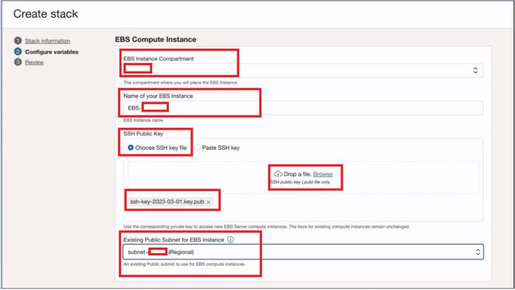

7. In the **OCI Identity Domain** section, select the **Compartment** where you want your **Identity Domain** to be created. Provide a valid **Domain Name**, **Admin Email Address** and basic admin details. Now Click on **Next**. 
	
    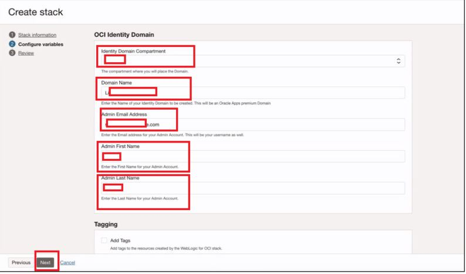
	
8. Now on the **Review Details** check for the configurations and then click on **Create** . Make sure the **Run Apply** is not selected.

	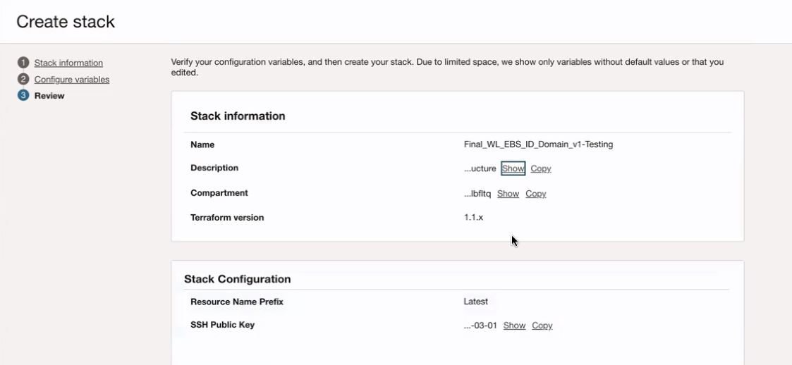
	
	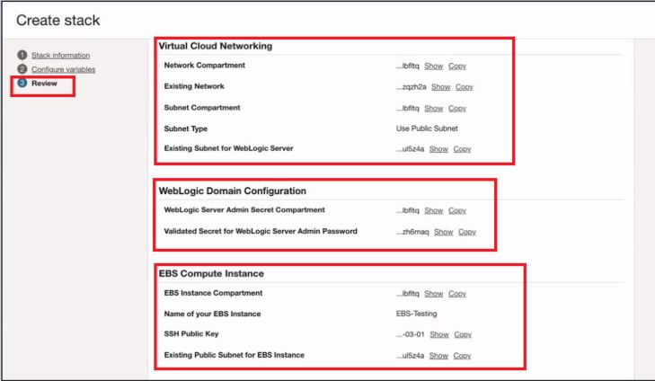
	
	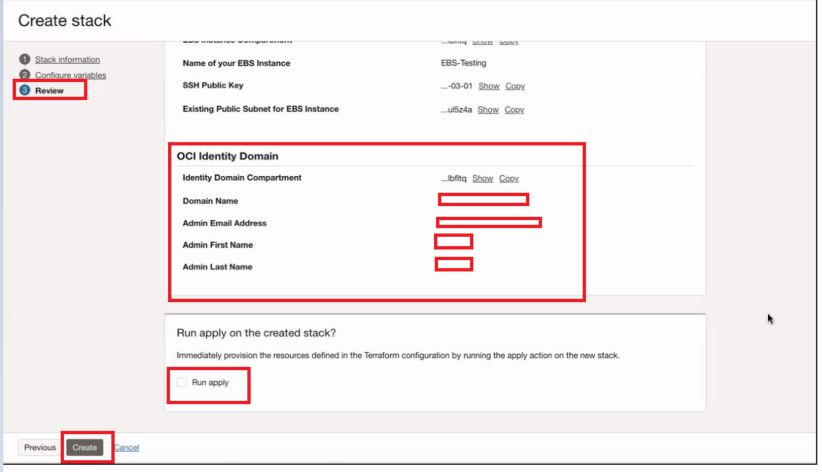
	
	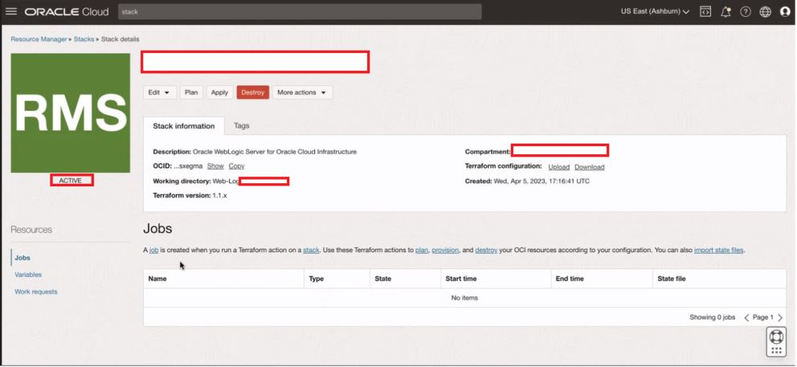
	
9. From the created stack now click on the **Plan** option. You should get an **Success** output.

	
	
	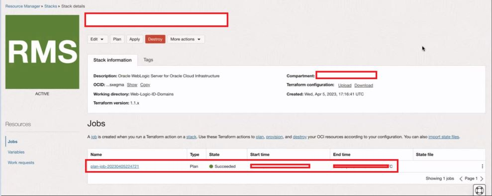
	
9. From the created stack now click on the **Apply** option. You should get an **Success** output.	

	

**Note** The stack might take around 30-40 mins to execute. Please wait until it gets created successfully.

## Task 2: Validation of the created resources.

Once the **Stack** is successfully deployed, we will update the **Hosts** File on our Local System and then will validate the deployed resources.

	1. Public Ip Address of Asserter  ebsasserter.example.com
	2. Public IP Address of EBS Instance  demoebs.example.com
	
**Note** Kindly use the value **ebsasserter.example.com** for EBS Asserter and **demoebs.example.com** for EBS Application throughout the lab.

1. Check the SSH access to your EBS Instance and Asserter Server. 

*With the Private Key of these instance, you should be able to SSH into these systems*

2. Check the EBS Instance

Try accessing your EBS Instance via this url - *http://demoebs.example.com:8000/OA_HTML/AppsLogin*

**Username** - *SYSADMIN*

**Password** - Enter your *SYSADMIN Password*

3. Navigate to **Domains** under **Identity and Security** on the OCI console to validate that your Domain of type **Oracle Apps Premium** has been created.

## Conclusion

In this Lab, we were able to successfully deploy and validate EBS Application, EBS Asserter Server and Identity Domain. 

 You may now **proceed to the next lab.**

## Acknowledgements
* **Author** - Gautam Mishra, Aqib Bhat, Samratha S P
* **Contributor** - Chetan Soni, Sagar Takkar
* **Supported By** - Deepak Rao Narasimha Gajendragad
* **Lead By** - Deepthi Shetty 
* **Last Updated By/Date** - Gautam Mishra May 2023
