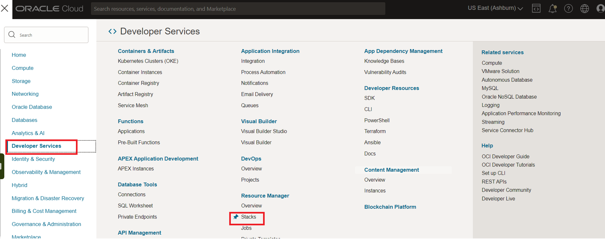
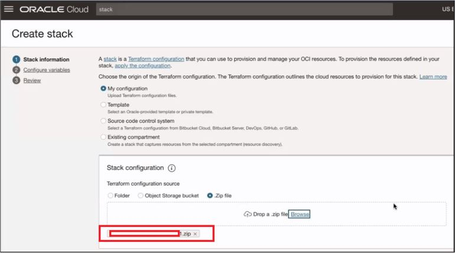
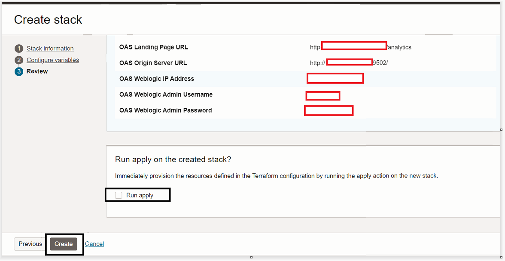
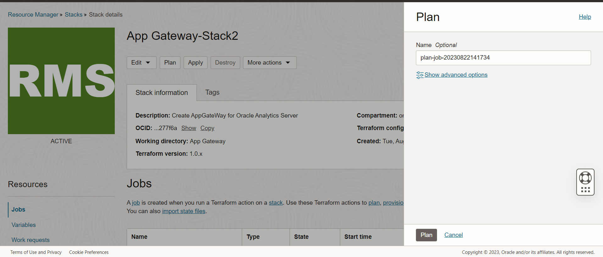
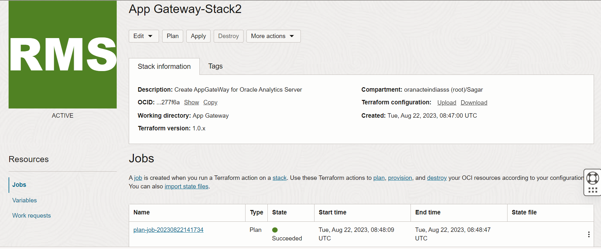
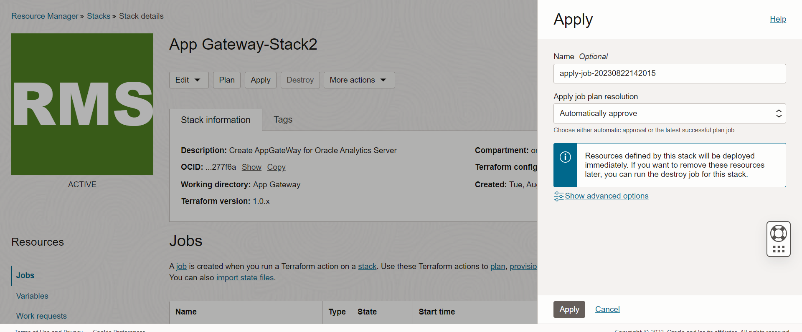
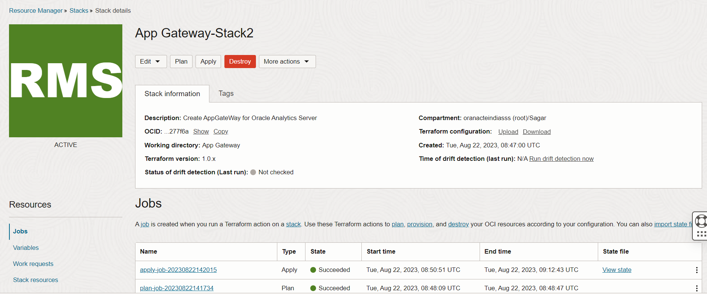

# Deploy the stack to configure OAS, AppGate and Identity Domain

## Introduction

Using this stack we will be able to configure **OAS, App Gateway and Identity Domain**. As part of this stack, a Enterprise application will be created under **Identity Domain**.

## Objectives

1.	Configure **OAS Application**
2. 	Configure **App Gateway**
3.	Create the **Enterprise Application** under **Identity Domain** 

## Prerequisites

Once the **Stack2- Configure.zip** is downloaded, unzip the zip file and replace the the content of the **.pem** files (AppGate_PrivateKey.pem and OAS_PrivateKey.pem) with your respective content of the private key.

## Task 1: Deploy the Configuration Stack via Resource Manager

1. Once logged in to OCI Console, navigate to **Developer Services** then select **Stacks** under **Resource Manager**. Now click on **Create Stack**.

	
	
	

**Note** Please do not select the **Root** compartment while creating the stack.
	
 
2. On the Create Stack Wizard, select the **Stack 2- Configure.zip** option and then browse to upload the **Deploy** stack that you downloaded in the previous lab. Now click on **Next**

	
	
	
	
	
	
**Note** The stack automatically picks up the working directory, provides the stack with a name and the working compartment gets selected. The Stack Name and Compartment can be changed if required.

3. Now, on the **Configure variables** section, fill in the below mentioned values, then click on **Next**

	1. *Public IP address of your AppGate Server*
	2. *Identity Domain URL - Domain URL of the Deployed Domain . **Note** Remove **:443** from the end of the Domain URL.*
   	3. *Client ID - Please enter the Client ID of your IDCS Confidential App*
    4. *Client Secret - Please enter the Client Secret of your IDCS Confidential App*
	5. *OAS Landing Page URL - This will cone from Stack one after the OAS Server will be deployed*
	6. *OAS Origin Server URL - This will cone from Stack one after the OAS Server will be deployed*
	7. *OAS Weblogic IP Address - This will cone from Stack one after the OAS Server will be deployed*
	8. *OAS Weblogic Admin Username - Same username that you used in Satck one*
	8. *Enter WebLogic password - Same username that you used in Satck one*
    

	
	
	
4. Now on the **Review Details** check for the configurations and then click on **Create** . Make sure the **Run Apply** is not selected.

	
	
	
	
9. From the created stack now click on the **Plan** option. You should get an **Success** output.

	
	
	
	
9. From the created stack now click on the **Apply** option. You should get an **Success** output.	

	

	
	
**Note** The stack might take around 35 mins for execution. Please wait until the **job** succeeds.

	
## Conclusion
 
In this lab, we were able to successfully deploy and configure OAS Application, App Gateway Server and Identity Domain. 

 You may now **proceed to the next lab.**

## Acknowledgements
* **Author** - Chetan Soni, Sagar Takkar
* **Lead By** - Deepthi Shetty 
* **Last Updated By/Date** - Chetan Soni August 2023

