# Deploy the stack to install OAS, App Gateway Instance and Identity Domain

## Introduction

Using this stack we will be able to deploy/install **OAS Application, App Gateway server and Identity Domain**. The Identity Domain created will be of the type **Oracle Apps Premium**.

*Estimated Lab Time:* 40 minutes

### Objectives
1.	Deploy and configure **OAS Application**
2. 	Deploy **App Gateway Server**
3.	Deploy the **Identity Domain** of the type **Oracle Apps Premium**
4.	Validate the created resources via web browser and via SSH access.

### Prerequisites

1. Once the **Stack1- Deploy.zip** is downloaded and keep it ready.
2. Complete the previous labs.

## Task 1: Deploy the Stack via Resource Manager

1. Once logged in to the OCI Console, navigate to **Developer Services** then select **Stacks** under **Resource Manager**. Now click on **Create Stack**.
	
	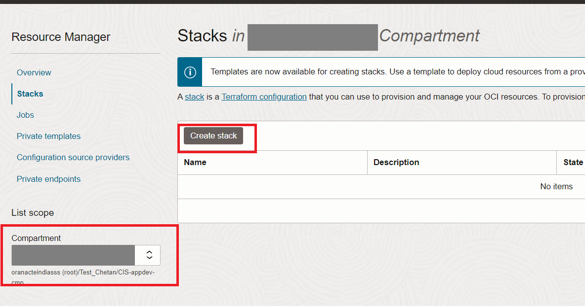
	
**Note** Please do not select the **Root** compartment while creating the stack.
	 
2. On the Create Stack Wizard, select the **.zip** option and then browse to upload the **Deploy** stack that you downloaded in the previous lab. Now click on **Next**

	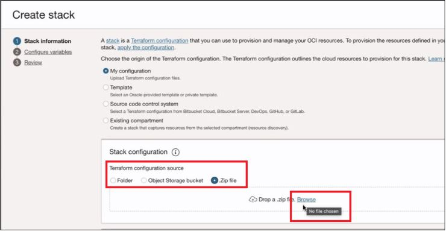
	
	
	
	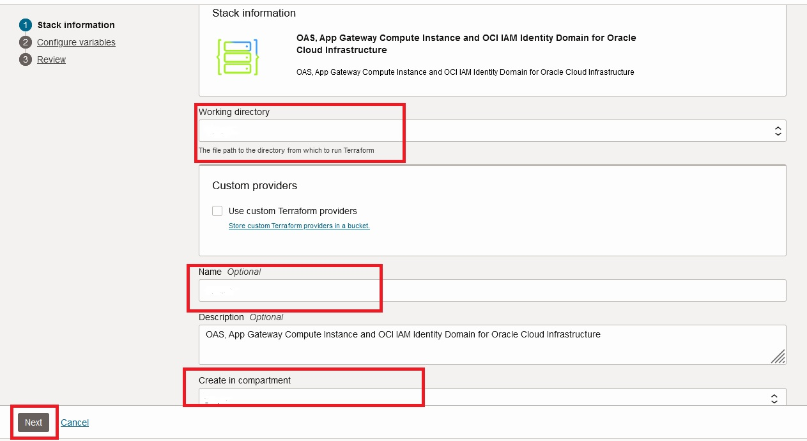
	
**Note** The stack automatically picks up the working directory, provides the stack with a name and the working compartment gets selected. The Stack Name and Compartment can be changed if required.

3. In the  **Oracle Anlytics Server Compute Instance** section, provide the **Display Name** for the OAS instance, choose the **Compartment** for your instance to be placed in. Then select the **Availability Domain** for the instance. Choose the **Shape** and **Boot Volume Size** for the instance and then upload your **SSH Publik Key**.

	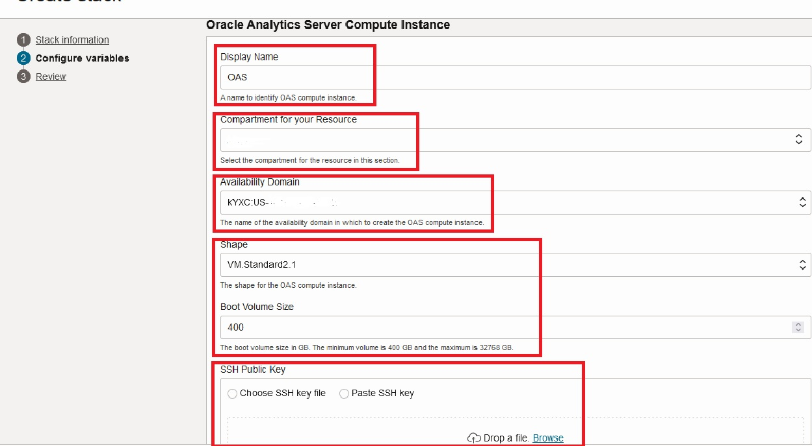
	
**Note** SSH Public Key needs to generated as a prerequisites.
	
4. In the **Networking Configuration** section, select the **VCN Compartment** that has your **Existing Network**, then select the **Subnet**. 
Select the checkbox for **Assign a public IP address to the compute instance** if you have choosen the public subnet.

	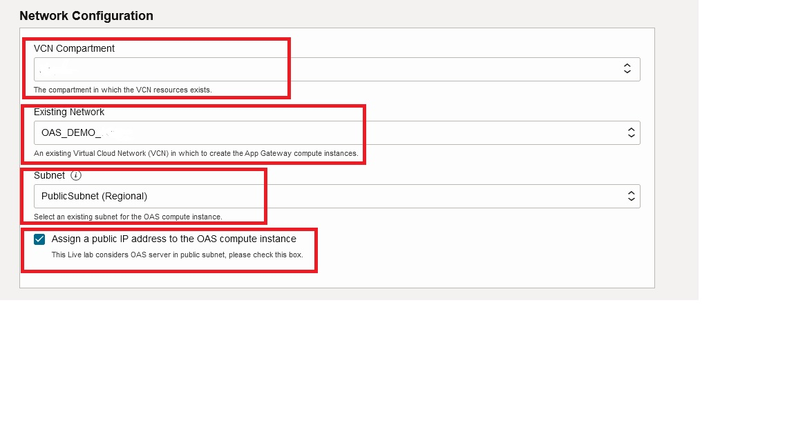	
	
5. In the **Oracle Analytics Server Domain Configuration** section, select the checkbox to create the OAS Domain.
Provide the **Analytics Administrator Username** and **Analytics Administrator Password**, this username and password will be used for login to the WebLogic deployed on OAS instance. Then provide the **Database Connection String** in specified format and DB should be Oracle Cloud VM DB System.
Specify the **Database Administrator Username** from the Oracle VM DB system you created. Also, specify the **Database Administrator Password** to connect to your database. Then provide the **Database Schema Prefix** and **Database Schema Password** to complete the domain configuration.

	

6. In the **App Gateway Compute Instance** section, Choose the **Instance Compartment** to place your app gateway instance. Provide **Name of your Instance** for App Gateway. Then upload your **SSH Public Key**. Now choose the **Availability Domain** to keep your instance. Then choose **Network Compartment** for selecting the **Existing Network** for App gateway. Also, choose the **Existing Public Subnet for Instance**

	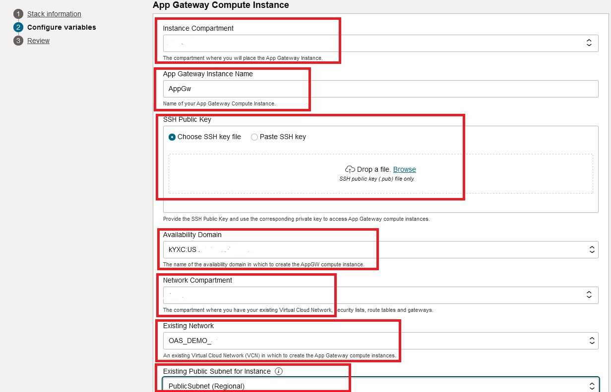
	
7. In the **OCI Identity Domain** section, select the **Compartment** where you want your **Identity Domain** to be created. Provide a valid **Domain Name**, **Admin Email Address** and basic admin details. Now Click on **Next**. 
	
    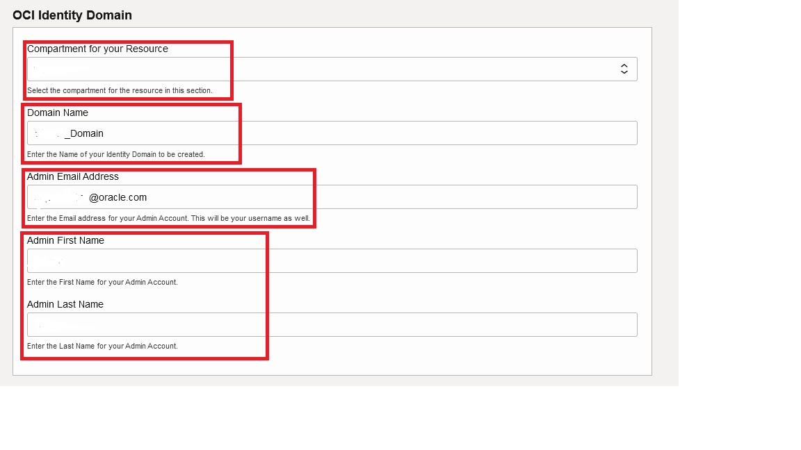
	
8. Now on the **Review Details** check for the configurations and then click on **Create** . Make sure the **Run Apply** is not selected.

	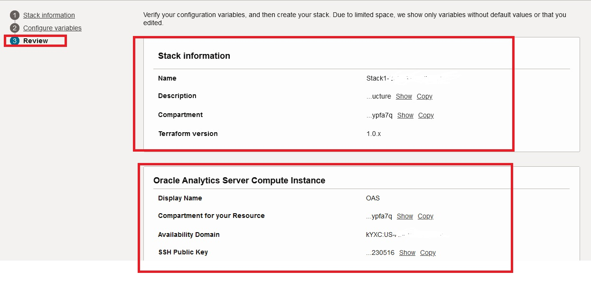
	
	
	
	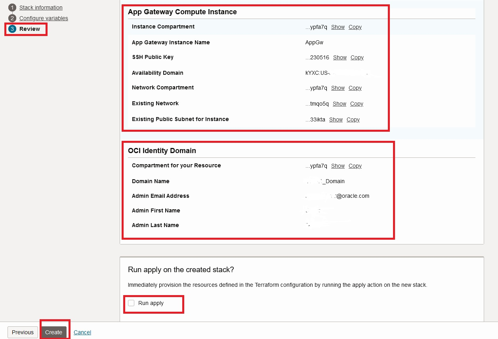
	
	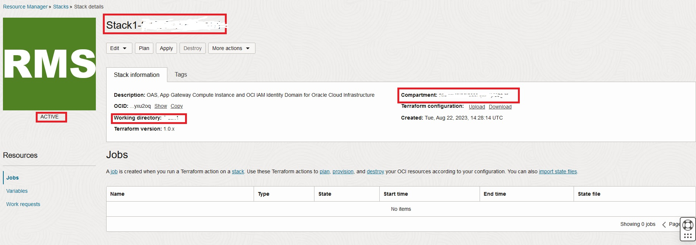
	
9. From the created stack now click on the **Plan** option. You should get an **Success** output.

	
	
	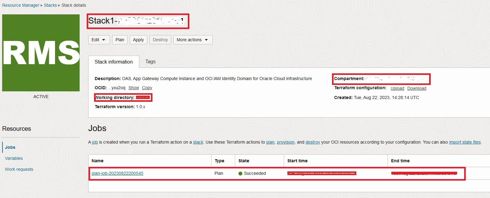
	
10. From the created stack now click on the **Apply** option. You should get an **Success** output.	

	

**Note** The Stack deployment will take 2 minutes to complete but creation of OAS Domain will take approximately 30-40 minutes.

## Task 2: Validation of the created resources.

Check the SSH to your OAS instance and App Gateway instance.

*With the Private Key of these instance, you should be able to SSH into these systems*


1. Once the **Stack** is successfully deployed, you can SSH in to OAS instance and check below.
	1. Navigate to the **/u01/app/oas-scripts** directory and look for the file **oas\_install.finish**. This file indicates that the OAS Domain installation is complete.
	2. Navigate to the **/var/log** directory and check the log files **oas\_cloudinit.log** and **oas\_create\_domain.log** to verify that the domain created successfully.

2. Check the OAS WebLogic Instance

Try accessing your OAS WebLogic Instance via this url - 

```
http://OAS_Instance_Public_IP:9500/console
```

**Username** - *Analytics Administrator Username*

**Password** - *Analytics Administrator Password*

3. Navigate to **Domains** under **Identity and Security** on the OCI console to validate that your Domain of type **Oracle Apps Premium** has been created.

## Conclusion

In this Lab, we were able to successfully deployed and validate OAS Application, App Gateway Server and Identity Domain. 

You may now **proceed to the next lab.**

## Acknowledgements
* **Author** - Sagar Takkar, Chetan Soni
* **Lead By** - Deepthi Shetty 
* **Last Updated By/Date** - Sagar Takkar November 2023
