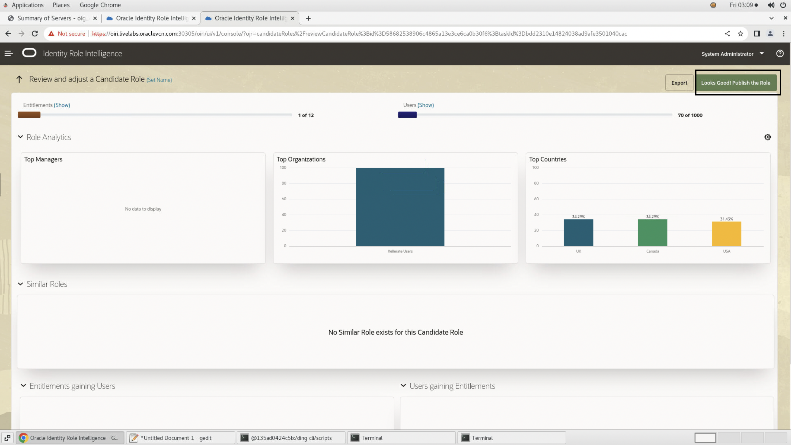
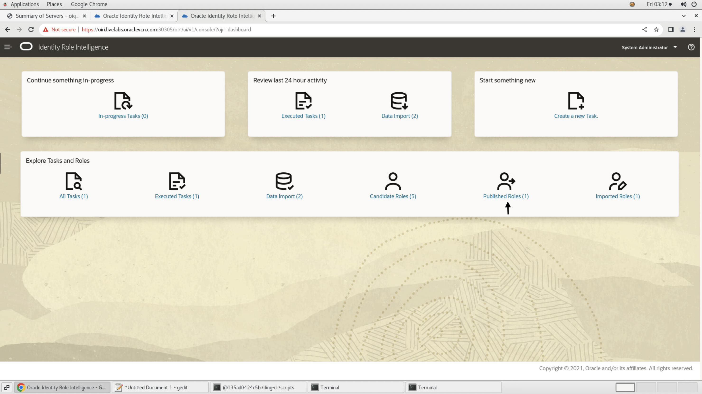
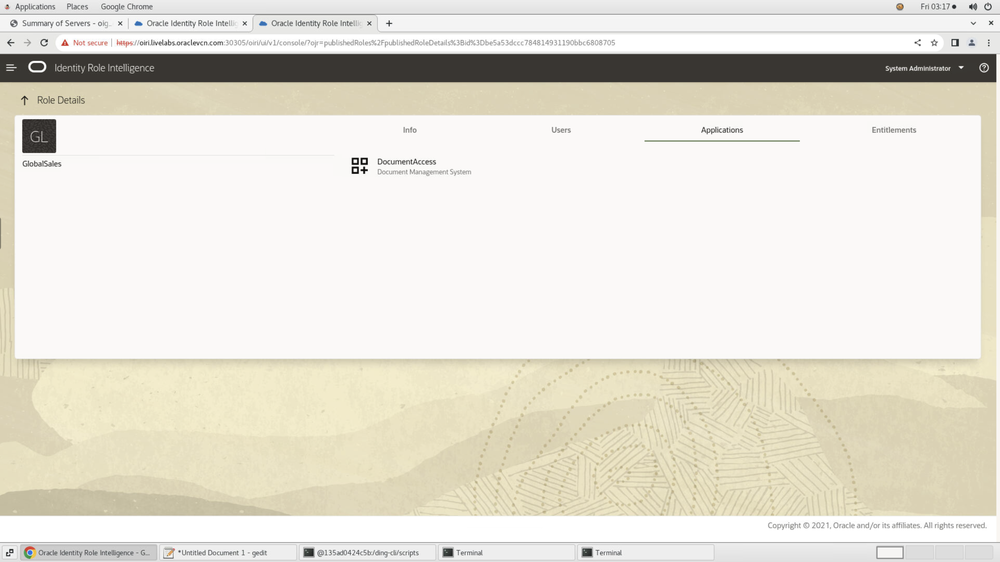
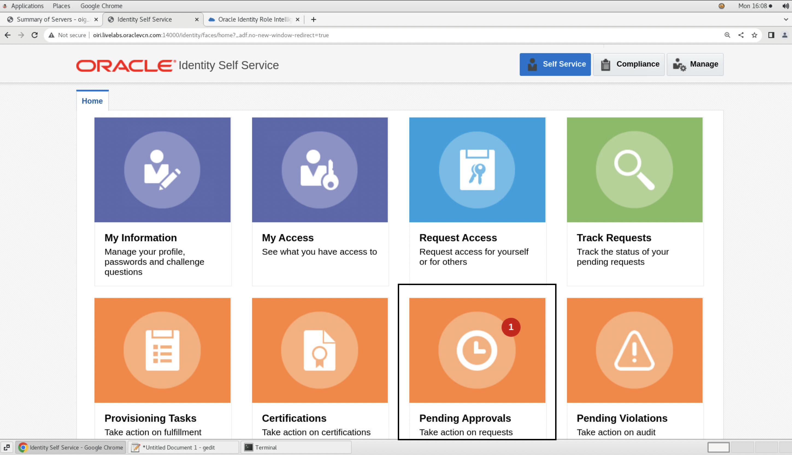
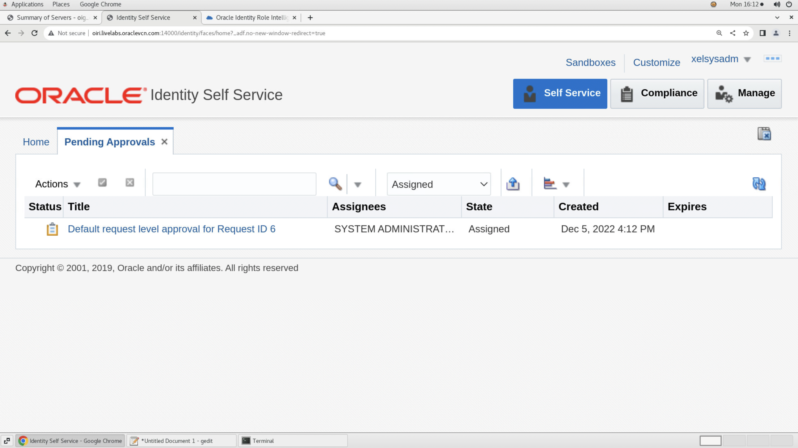
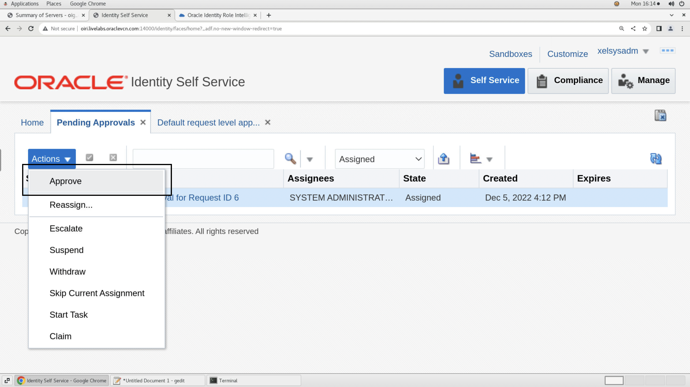
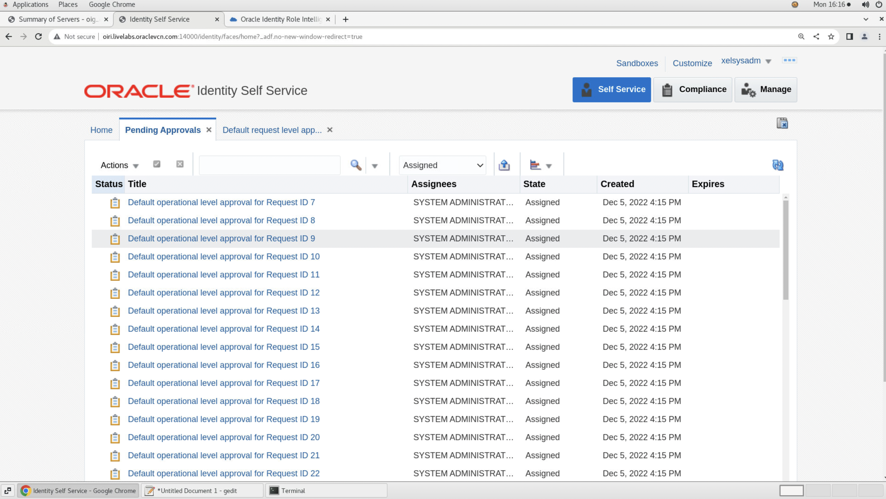
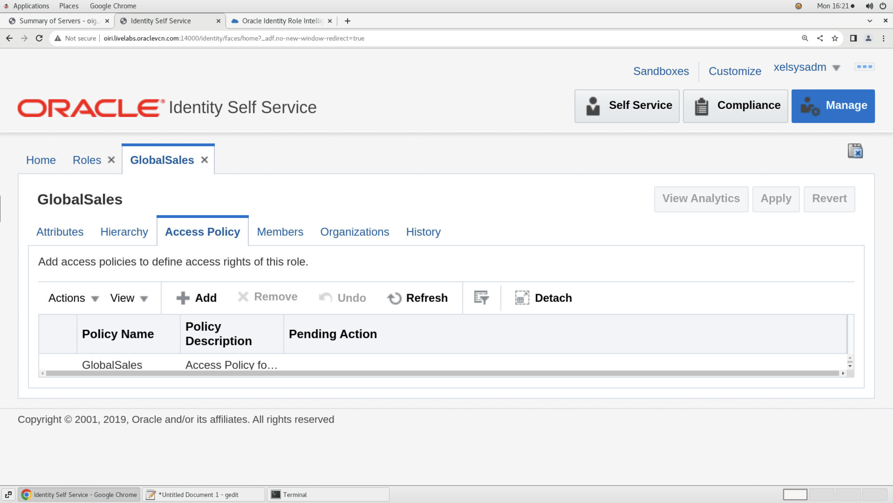

# Publish role to OIG

## Introduction

This lab we will Publish roles from OIRI into OIG.

*Estimated Lab Time*: 15 minutes

### Objectives

In this lab, you will:
* Publish roles from OIRI to OIG

### Prerequisites
This lab assumes you have:
- A Free Tier, Paid or LiveLabs Oracle Cloud account
- You have completed:
    - Lab: Prepare Setup (*Free-tier* and *Paid Tenants* only)
    - Lab: Environment Setup
    - Lab: Initialize Environment
    - Lab: Deploy Kubernetes Cluster and Start OIG Server
    - Lab: Deploy OIRI in the local Kubernetes Node
    - Lab: Import Data into OIRI from OIG
    - Lab: Role Mining

## Task 1: Publish a candidate role

1. In the Review and Adjust Candidate Role page, click *Looks Good! Publish the role*. The Publish Role dialog box appears.

    

2. In the Candidate Role Name field, enter a name (for eg: GlobalSales) for the candidate role. This is a required field.

    

3. Click *Publish*.

4. Go back to the Identity Role Intelligence home page and in the *Explore Tasks and Roles* tile, click on *Published Roles*.

    


5. Click the role you want to review. Alternatively, you can click the view role icon on the right.
The Role Details page is displayed.

    

6. Click the Info tab. This tab displays the role information, such as role name, description, and the number of users, applications, and entitlements in the role.

    

7. Click the Users tab.
The list of users in the role is displayed. You can search for particular users by using the Search field.

    

8. Click the Applications tab.
The list of applications in the role is displayed.

    

9. Click the Entitlements tab.
The list of entitlements in the role along with the associated applications is displayed. You can filter the entitlements by entitlement name or application name, and search for particular entitlements by using the Search field.

    

## Task 2: Review published role in OIG

1. Sign in to Identity Self Service console.
Open a browser tab using the below URL to access *OIG Identity Console*.

    ```
    URL        http://oiri.livelabs.oraclevcn.com:14000/identity
    Username   Xelsysadm
    Password   Welcome1
    ```


2. Click Self Service. Self service Home page is displayed.


3. Click the Pending Approvals box. The Pending Approvals page is displayed. Notice that the Approval request for the published role (GlobalSales) is displayed.

    


4. Click on the approval request. The task details page displays a detailed view of the request in the Details section, Summary Information section, the Request Details tab, the Approvals tab, and the Cart Items section. It allows complete management of the listed task.
Click on *Approve*.

    

    


5. A default request level approval is generated. Click on the approval request and then Click *Approve*.
The task is now approved and is no longer displayed.

    

    


6. Click on the refresh icon and notice that default approval request is generated for each of the users that were a part of the published role.

    

7. Select all the requests and click on *Actions* and select *Approve*. Enter appropriate comments and click on *OK*.

    *Note : To Select all requests, select any one request and then press ctrl+A*

    

    

8. Click on the refresh icon and make sure that there are no pending approvals.

9. Click on Manage on the top right corner. Then, click on *Roles and Access policies* and select *Roles*.

    

10. Notice that the Role (GlobalSales) has been published in OIG.

    

11. Click on the role to review the members and access policy associated with the role.

    

    


## **Summary**

You have now completed the OIRI workshop. In this workshop, we learnt:
  - How to deploy OIRI
  - How to import Entity data into OIRI from OIG database
  - How to run role mining tasks to discover candidate roles
  - How to analyze candidate roles, review candidate roles using the analytics provided in OIRI
  - How to publish candidate role into OIG

From the knowledge gained from this workshop, you can now use OIRI to implement:
  - Automation of role discovery and provisioning to eliminate the error-prone and manual process of creating roles
  - Optimize existing RBAC
  - What if analysis that is useful for mergers, acquisitions, or new application onboarding


## Acknowledgements
* **Author** - Keerti R, Brijith TG, Anuj Tripathi, NATD Solution Engineering
* **Contributors** -  Keerti R, Brijith TG, Anuj Tripathi
* **Last Updated By/Date** - Indiradarshni B, NATD Solution Engineering, December 2022
